# Отчет по выполнению задания DO6_CICD

1. [Part 1. Настройка gitlab runner](#part-1-настройка-gitlab-runner)
2. [Part 2. Сборка](#part-2-сборка)
3. [Part 3. Тест кодстайла](#part-3-тест-кодстайла)
4. [Part 4. Интеграционные тесты](#part-4-интеграционные-тесты)
5. [Part 5. Этап деплоя](#part-5-этап-деплоя)
6. [Part 6. Дополнительно. Уведомления](#part-6-дополнительно-уведомления)

## Part 1. Настройка gitlab runner

- Установим систему Ubuntu 22.04 без GUI. Настроим время и его синхронизацию. Подключим репозиторий и скачаем comunity-версию gitlab'а.
```
sudo apt update
sudo apt upgrade (при желании)
sudo timedatectl set-timezone Europe/Moscow
sudo apt install chrony
sudo systemctl enable chrony
sudo apt install curl openssh-server ca-certificates
sudo curl https://packages.gitlab.com/install/repositories/gitlab/gitlab-ce/script.deb.sh | sudo bash
```

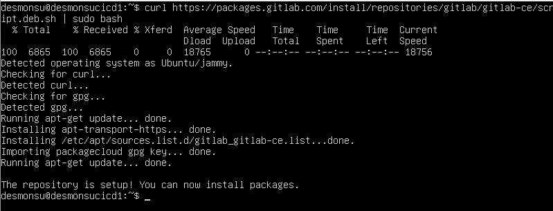<br>
Рис. 1.1. Установка репозитория Gitlab

```
sudo apt install gitlab-ce
```
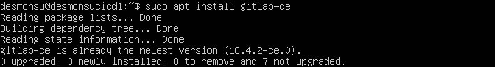<br>
Рис. 1.2. Установка Gitlab

- Подключим репозиторий gitlab-runner
```
curl -L "https://packages.gitlab.com/install/repositories/runner/gitlab-runner/script.deb.sh" | sudo bash
```

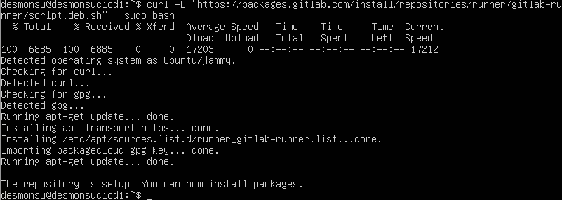<br>
Рис. 1.3. Установка репозитория Gitlab-runner

- Установим gitlab-runner
```
apt install gitlab-runner
```

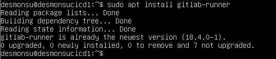<br>
Рис. 1.4. Установка Gitlab-runner

- Регистрируем проект в gitlab-runner
```
gitlab-runner register
```

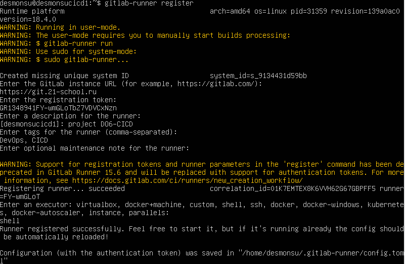<br>
Рис. 1.5. Регистрация в Gitlab-runner

## Сборка

- Создаем в корневой папке файл .gitlab-ci.yml, переносим свой проект SimpleBashUtils из Gitlab и кладем его в папку src. Редактируем файл .gitlab-ci.yml и задаем ему цели сборки.

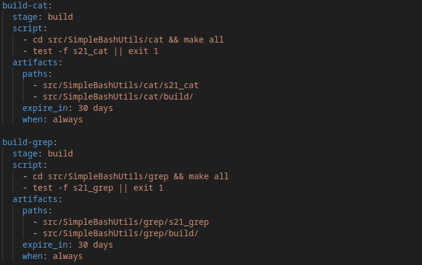<br>
Рис. 2.1. Цели для gitlab-ci

- Убеждаемся, что пуш произошел успешно

<br>
Рис. 2.2. Успешно запушенный build для Gitlab

## Тест кодстайла

- Редактируем текст .gitlab-ci.yml для проверки код-стайла

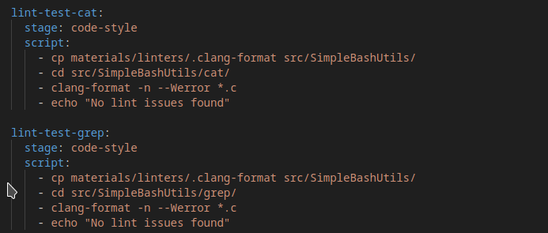<br>
Рис. 3.1. Текст конфига

- Проверим, что проверка на код-стайл заработала

<br>
Рис. 3.2. Успешно запушенный linter на Gitlab

- Намеренно сломаем один из файлов, чтобы понять, что CICD верно валит неверные пуши

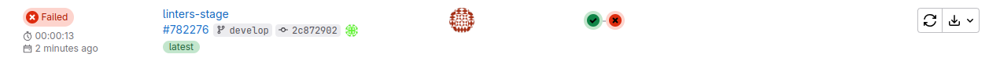<br>
Рис. 3.3. Заваленный линтером пуш

- Проверим, что ошибка линтера вывелась в лог

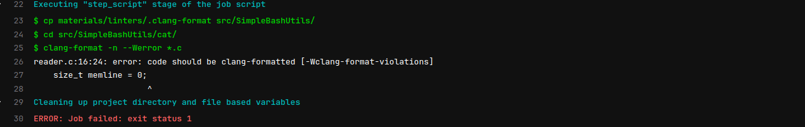<br>
Рис. 3.4. Ошибка линтера в логе

## Интеграционные тесты

- Редактируем текст .gitlab-ci.yml для проверки интеграционных тестов

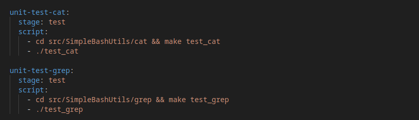<br>
Рис. 4.1. Текст конфига

- Проверим, что проверка тестов заработала

<br>
Рис. 4.2. Пуш, успешно прошедший интеграционные тесты

- Намеренно сломаем один из файлов, чтобы понять, что CICD верно валит неверные пуши

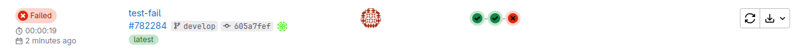<br>
Рис. 4.3. Заваленный тестами пуш

- Проверим, что ошибка тестов вывелась в лог

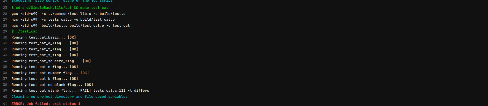<br>
Рис. 4.4. Ошибка линтера в логе

## Этап деплоя

- Соединим компьютеры по ssh, напишем код для деплоя

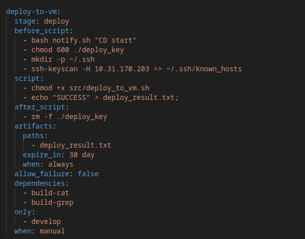<br>
Рис. 5.1. Код деплоя в yml

## Дополнительно. Уведомления

- Напишем код уведомлений и скрипт уведомлений

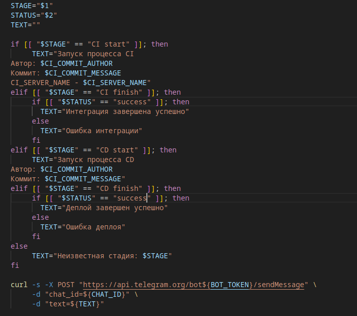<br>
Рис. 6.1. Код для уведомлений

- Соединим компьютеры по ssh, напишем код для деплоя

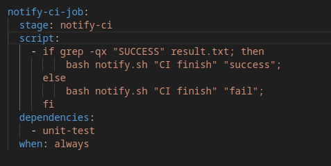<br>
Рис. 6.2. Уведомления для режультата этапа CI

- Соединим компьютеры по ssh, напишем код для деплоя

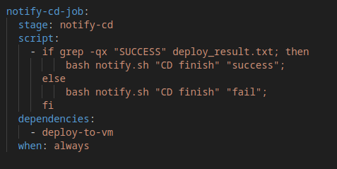<br>
Рис. 6.3. Уведомления для режультата этапа CI

