# Отчет по выполнению задания DO2_LinuxNetwork

1. [Part 1. Готовый докер](#part-1-готовый-докер)
2. [Part 2. Операции с контейнером](#part-2-операции-с-контейнером)
3. [Part 3. Мини веб-сервер](#part-3-мини-веб-сервер)
4. [Part 4. Свой докер](#part-4-свой-докер)
5. [Part 5. Dockle](#part-5-dockle)
6. [Part 6. Базовый Docker Compose](#part-6-базовый-docker-compose)

## Part 1. Готовый докер

- Для начала работы установим докер командой

```
sudo apt install docker.io
```

- Зайдем на сайт с официальными реестрами докер-образов

```
hub.docker.com
```

- Найдем там необходимый пакет и увидим перечень тегов с различными версиями и возможностями для различных проектов. Так как в задании не указана конкретная версия, не будем вводит никакого тега, что приведет к скачке образа с тегом latest

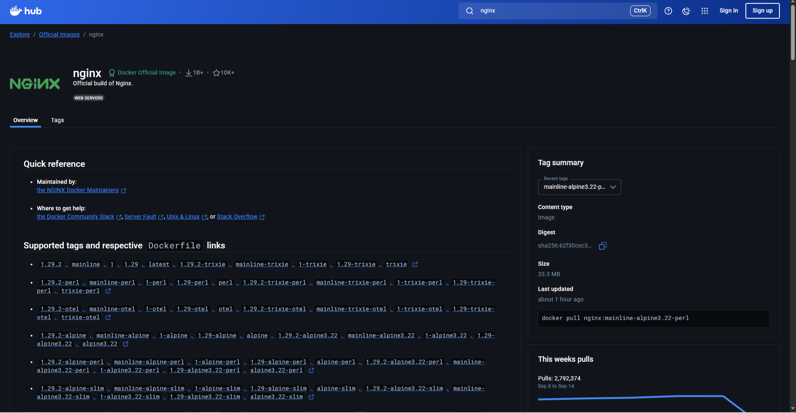<br>
Рис. 1.1. Docker Hub

- Для скачивания образа введем команду

```
sudo docker pull nginx
```

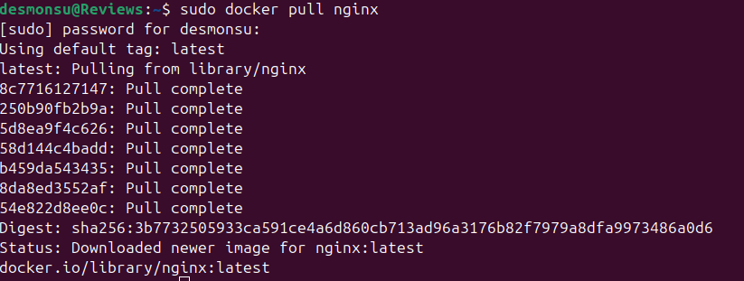<br>
Рис. 1.2. Выкачка официального докер-образа

- Проверим наличие докер-образа командой

```
sudo docker images
```

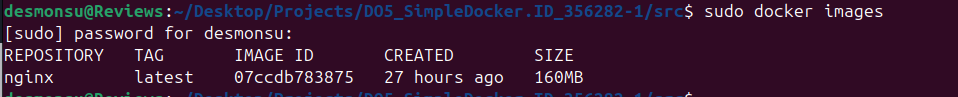<br>
Рис. 1.3. Наличие докер-образа

- Запустим наш докер-образ

```
sudo docker run -d nginx
```

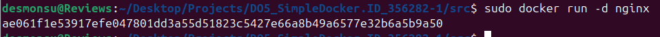<br>
Рис. 1.4. Запуск докер-образа

- Проверим, что докер действитеьно запустился

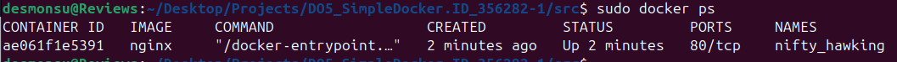<br>
Рис. 1.5. Список текущих процессов

- Посмотрим информацию о контейнере через команду

```
sudo docker inspect {Имя контейнера или контейнер_id}
```

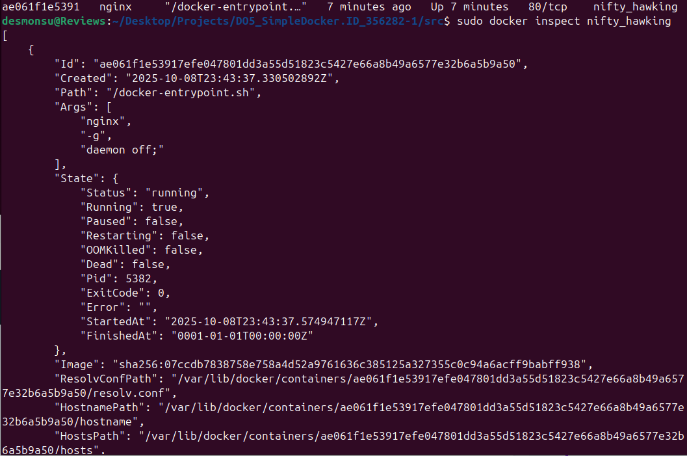<br>
Рис. 1.6. Вывод команды inspect

- Определим ip контейнера, список замапленных портов и размер контейнера

- ip и список портов сожно получить без дополнительных флагов

<br>
Рис. 1.7. IP контейнера

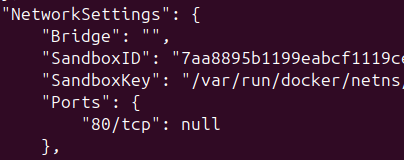<br>
Рис. 1.8. Список замапленных портов

- Как видим 80/tcp-порт объявлен, но не замаплен на хост

- Для того, чтобы определить размер контейнера необходимо ввести команду с флагом --size

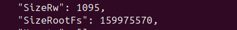<br>
Рис. 1.9. Размер контейнера

- SizeRootFs - Общий размер файловой системы контейнера (Измеряется в байтах)
- SizeRw - Размер изменений, относительно базового образа(Измеряется в байтах)

- Важно отметить, что вывод по image выдает другой результат

- Остановим контейнер через команду

```
sudo docker stop container_name
```

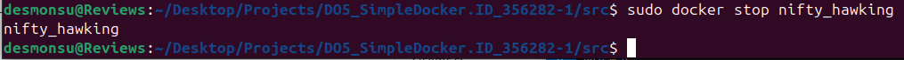<br>
Рис. 1.10. Остановка контейнера

- Проверим, что контейнер действительно остановился

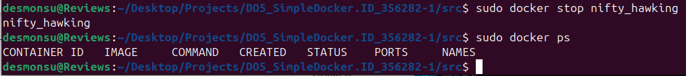<br>
Рис. 1.11. Пустой список активных контейнеров

- Запустим контейнер с портами, замапленными на такие же порты на локальной машине командой

```
sudo docker run -p 80:80 -p 433:433 nginx
```

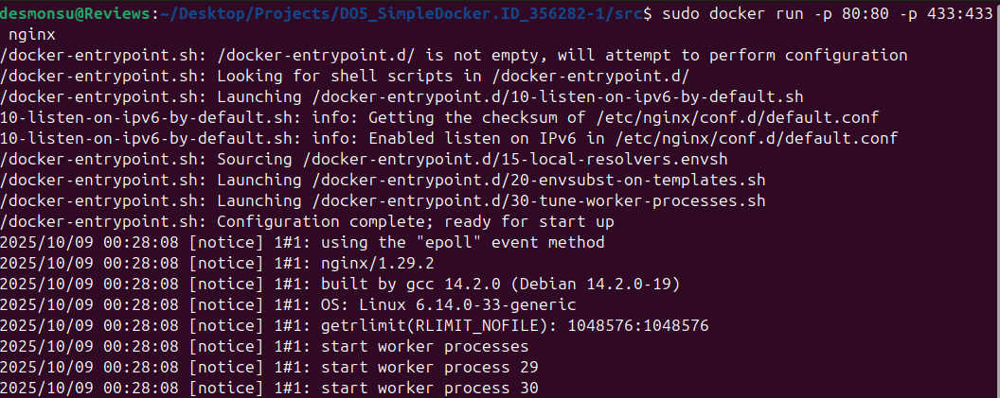<br>
Рис. 1.12. Список активных контейнеров

- Зайдем на сайт localhost:80 и убедимся, что там открывается стартовая страница nginx

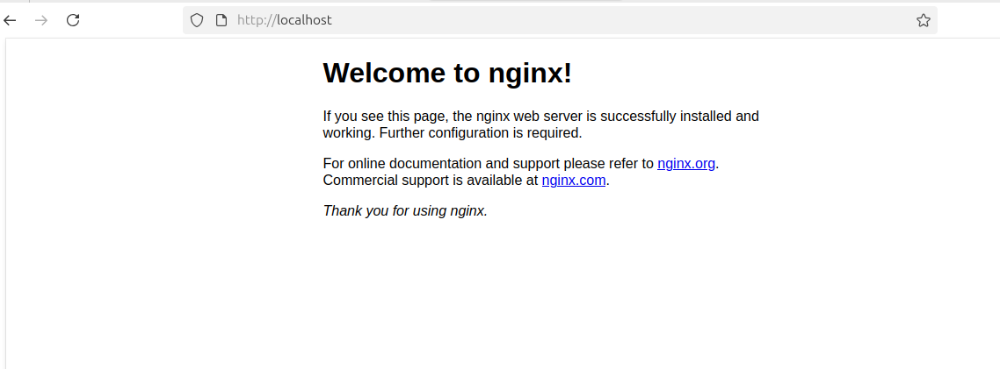<br>
Рис. 1.13. Стартовая страница nginx на localhost

- Выйдем из контейнера, что приведет к его выключению.

- Выведем список открытых ранее контейнеров командой

```
sudo docker ps -a
```

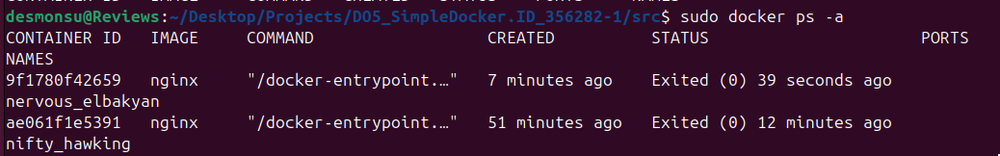<br>
Рис. 1.14. Список всех созданных контейнеров

- В связи с тем, что из задания неясно какой именно из контейнеров нужно перезапустить, выберем последний, как более свежий.

- Проверим, что он действительно запустился, вызвав лист активных контейнеров

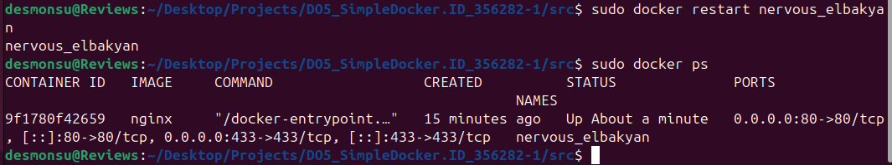<br>
Рис. 1.15. Стартовая страница nginx на localhost

## Part 2. Операции с контейнером

- Чтобы просмотреть содержимое файла conf, введем команду

```
sudo docker exec <имя или id контейнера> cat /etc/nginx/nginx.conf
```

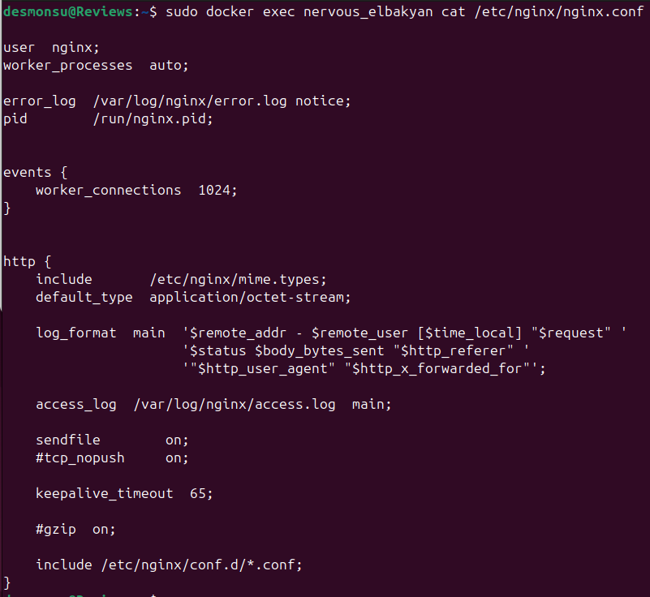<br>
Рис. 2.1. Файл конфигурации nginx

- Создадим файл конфигурации nginx.conf на локальной машине в папке src

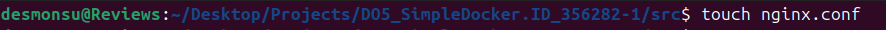<br>
Рис. 2.2. Новый файл конфигурации nginx

- Настроим выдачу страницы статуса сервера nginx

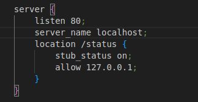<br>
Рис. 2.3. Измененный файл nginx

- Скопируем новый конфигурационный файл в контейнер

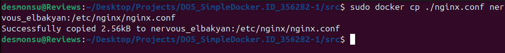<br>
Рис. 2.4. Копирование нового файла в контейнер

- Перезапустим nginx в контейнере командой

```
sudo docker exec -i <имя контейнера> nginx -s reload
```

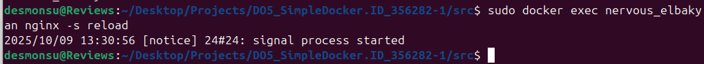<br>
Рис. 2.5. Рестарт службы внутри контейнера

- Проверим, что на пути localhost/status отображается страничка со статусом nginx

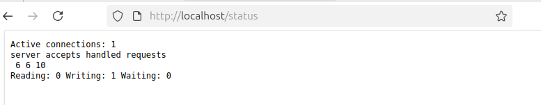<br>
Рис. 2.6. Статус сервера nginx

- Экспортируем докер-контейнер через команду

```
sudo docker export nervous_elbakyan > container.tar
```

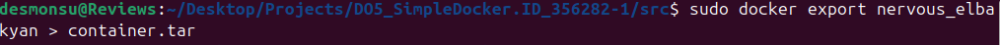<br>
Рис. 2.7. Экспорт контейнера из докера

- Остановим контейнер

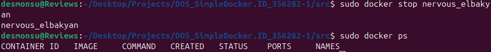<br>
Рис. 2.8. Остановка контейнера

- Удалим докер-образ командой

```
sudo docker rmi -f nginx
```

- Для удаления образа, который используется хотя бы в одном из контейнеров необходимо использовать флаг -f (forced)

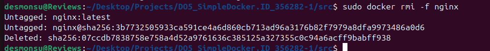<br>
Рис. 2.9. Удаление образа

- Удалим все созданные ранее контейнеры командой

```
sudo docker rm <имя_контейнера>
```

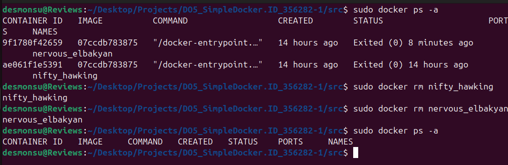<br>
Рис. 2.10. Удаление контейнеров

- Импортируем контейнер командой

```
sudo docker import <архив> <имя образа:тег>
```

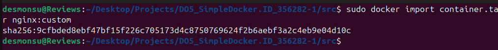<br>
Рис. 2.11. Импорт контейнера

- Запустим контейнер

```
sudo docker run -p 80:80 nginx:custom nginx -g "daemon off;"
```

- nginx -g "daemon off;" нужна для того, чтобы процесс nginx не уходил в фоновый режим, что повлекло бы за собой остановку контейнера из-за отсутствия команды по умолчанию (CMD). Этот параметр указан в образе nginx, но не переносится при использовании директив export/import.

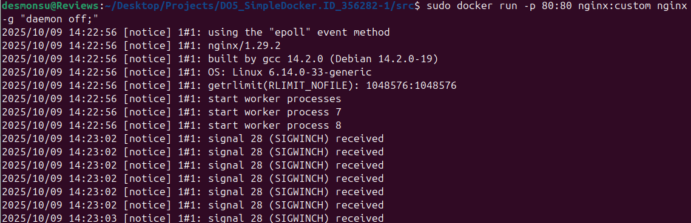<br>
Рис. 2.12. Запуск импортированного контейнера

- И проверяем состояние сервера nginx на localhost/status

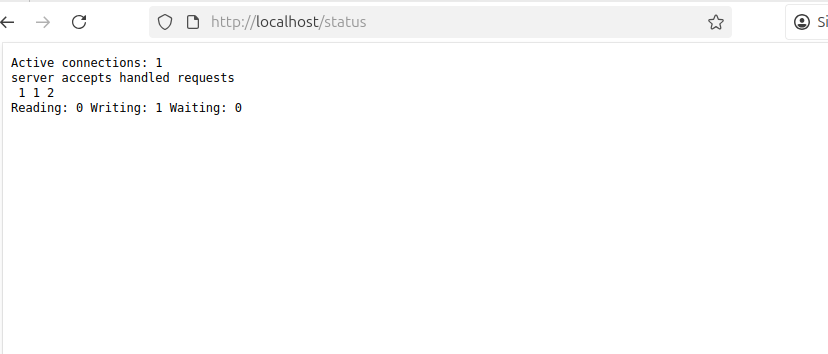<br>
Рис. 2.13. Страница статуса nginx после импорта контейнера

## Part 3. Мини веб-сервер

- Для работы с мини-сервером на базе fcgi скачаем библиотеку libfcgi-dev командой

```
sudo apt install libfcgi-dev
```

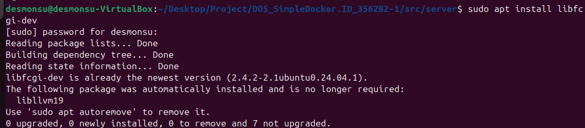<br>
Рис. 3.1. Установка библиотеки libfcgi

- Напишем код программы для показа фразы Hello, World в браузере

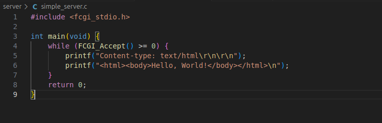<br>
Рис. 3.2. Код простого сервера

- Скомпилируем и запустим наш сервер

```
gcc <имя_файла.c> -lfcgi -o <вывод>
spawn-fcgi -p 8080 -n <вывод>
```

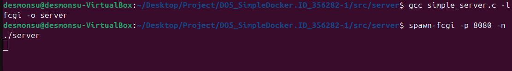<br>
Рис. 3.3. Запуск сервера через spawn-fcgi

- Напишем простой nginx.conf для проксирования запросов с 81 порта на 127.0.0.1:8080

<br>
Рис. 3.4. Текст нашего конфига

- Скопируем файл параметров и запустим nginx локально командой

```
sudo nginx -c $(pwd)/nginx.conf
```

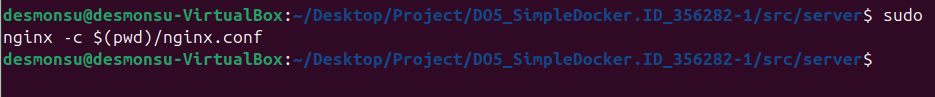<br>
Рис. 3.5. Запуск nginx локально

- Проверим, что наша страничка отдается в браузере по адресу localhost:81

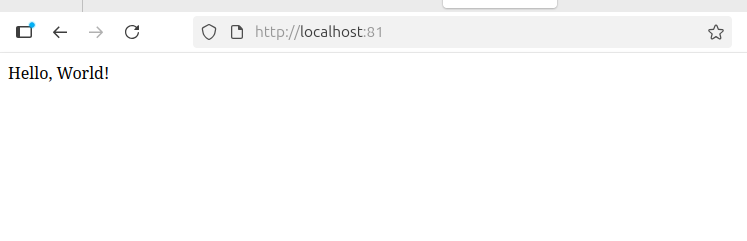<br>
Рис. 3.6. Результат вывода в браузере

- Положим файл nginx.conf в ./nginx/nginx.conf на будущее

## Part 4. Свой докер

- Создадим dockerfile для запуска nginx внутри контейнера

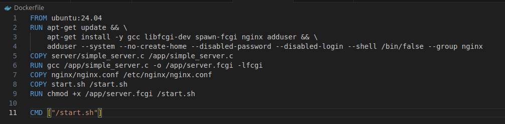<br>
Рис. 4.1. Текст докерфайла

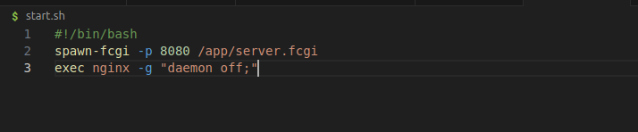<br>
Рис. 4.2. Текст баш-скрипта для старта сервисов внутри контейнера

- Для сборки докер-образа запустим команду
```
sudo docker build -t <image_name>:<tag> <dockerfile_directory>
```

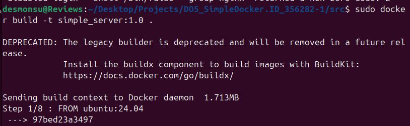<br>
Рис. 4.3. Запуск сборки докер-образа

- Проверим, что образ собрался корректно

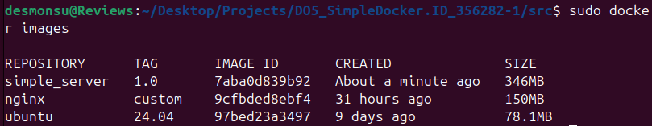<br>
Рис. 4.4. Список текущих докер-образов

- Запустим контейнер с маппингом 80 порта на 81 и маппингом папок с конфигами
```
sudo docker run -p 80:81 -v "$(pwd)/nginx":/etc/nginx simple_server:1.0
```
- Таким образом, мы обращаемся к 80-ому порту, который перевод сигнал на 81 порт, который слушает nginx, который в свою очередь перевдит сигнал на 8080 порт, который слушает наш сервер

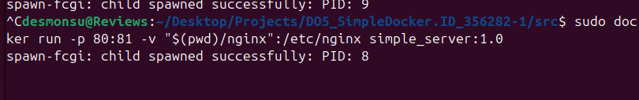<br>
Рис. 4.5. Запуск сервера в контейнере

- Зайдем на http://127.0.0.1:80, чтобы проверить, что наш редирект работает

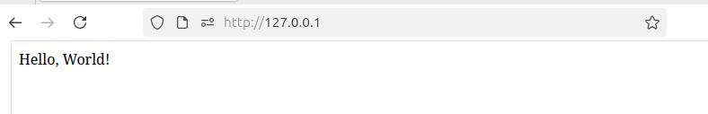<br>
Рис. 4.6. Проверка результата работы

- Изменим конфиг, чтобы он показывал статус сервера nginx

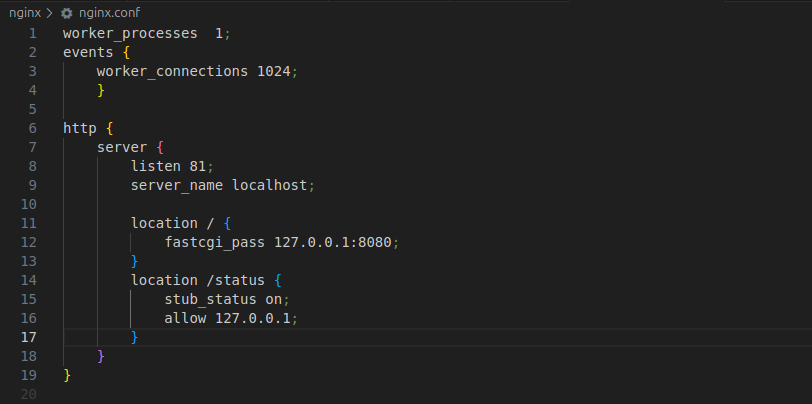<br>
Рис. 4.7. Измененный конфиг

- Перезапустим контейнер

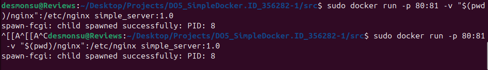<br>
Рис. 4.8. Перезапуск контейнера

- Видим, что статус индексируется

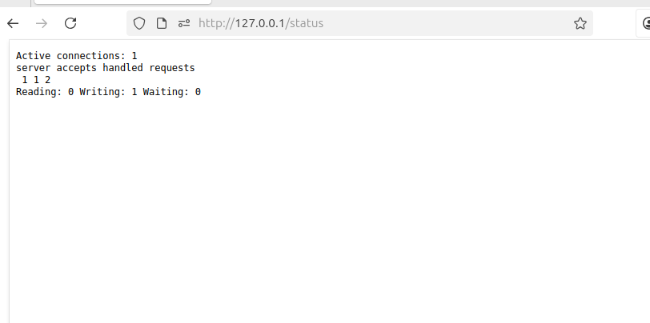<br>
Рис. 4.9. Статус сервера

## Part 5. Dockle

## Part 6. Базовый Docker Compose
