# Отчет по выполнению задания DO1_Linux

1. [Part 1. Установка ОС](#part-1-установка-ос)
2. [Part 2. Создание пользователя](#part-2-создание-пользователя)
3. [Part 3. Настройка сети ОС](#part-3-настройка-сети-ос)
4. [Part 4. Обновление ОС](#part-4-обновление-ос)
5. [Part 5. Использование команды sudo](#part-5-использование-команды-sudo)
6. [Part 6. Установка и настройка службы времени](#part-6-установка-и-настройка-службы-времени)
7. [Part 7. Установка и использование текстовых редакторов](#part-7-установка-и-использование-текстовых-редакторов)
8. [Part 8. Установка и базовая настройка сервиса SSHD](#part-8-установка-и-базовая-настройка-сервиса-sshd)
9. [Part 9. Установка и использование утилит top, htop](#part-9-установка-и-использование-утилит-top-htop)
10. [Part 10. Использование утилиты fdisk](#part-10-использование-утилиты-fdisk)
11. [Part 11. Использование утилиты df](#part-11-использование-утилиты-df)
12. [Part 12. Использование утилиты du](#part-12-использование-утилиты-du)
13. [Part 13. Установка и использование утилиты ncdu](#part-13-установка-и-использование-утилиты-ncdu)
14. [Part 14. Работа с системными журналами](#part-14-работа-с-системными-журналами)
15. [Part 15. Использование планировщика заданий CRON](#part-15-использование-планировщика-заданий-cron)

## Part 1. Установка ОС

- Для выполнения этого задания была установлена программа для работы с виртуальными машинами VirtualBox.
- С официального сайта скачан образ системы Ubuntu версии 20.04.6 Server без графического интерфейса.
- Результат выполнения команды cat /etc/issue

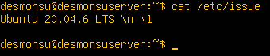

## Part 2. Создание пользователя

- Введем команду для создания нового пользователя

```
sudo adduser newdesmonsu
```

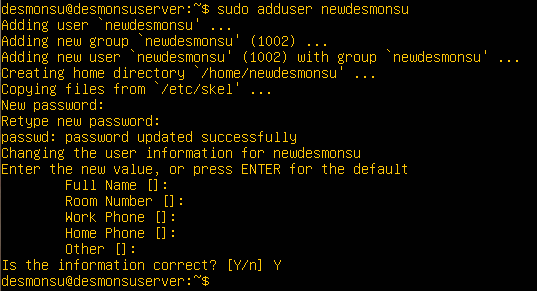

- Добавим пользователя в группу adm

```
sudo usermod -a -G adm newdesmonsu
```


- Выведем список пользователей командой

```
cat /etc/passwd
```

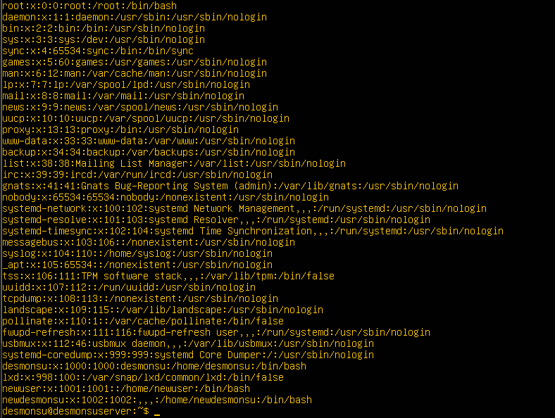

- Пользователь newdesmonsu присутствует в выводе команды

## Part 3. Настройка сети ОС

- Для определения имени машины введем команду

```
hostname
```

- Изменим имя машины на соответствующее заданию с помощью команды

```
sudo hostname user-1
```

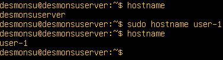

- Для того, чтобы имя машины сохранилось после перезагрузки системы можно воспользоваться командой

```
sudo hostnamectl set-hostname user-1
```

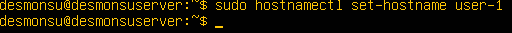

- Выведем на экран текущее время машины командой

```
date
```

- Видим, что выставлено время AM UTC. Для смены часового пояса введем команду

```
sudo timedactl set-timezone Europe/Moscow
```

- Повторно введем команду date, чтобы убедиться, что время изменилось.

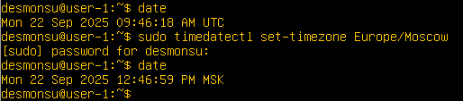

- Для выведения информации о сетевых интерфейсах введем команду

```
ip l
```

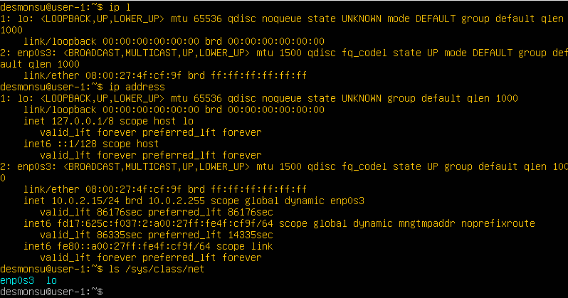

- Как видим команда вывела нам информацию о сетевых интерфейсах lo и enp0s3

> Интерфейс lo (loopback, localhost) - виртуальный сетевой интерфейс, расположенный по адресу 127.0.0.1, предназначенный для обращения компьютера к самому себе без необходимости выхода в сеть. Интерфейс необходим для корректной работы приложений, использующих сетевой трафик, даже в рамках одного компьютера (тестирование клиент-серверных приложений)

- Выведем в консоль ip-адрес устройства, на котором работаем с помощью команды

```
cat /var/log/syslog | grep -i DHCP
```

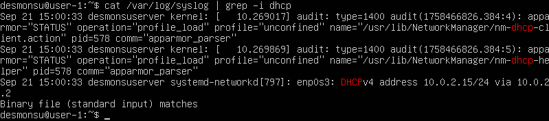

- Как видим, нам был выдан Ip-адрес 10.0.2.15

> DHCP (Dynamic Host Configuration Protocol) - это сетевой протокол позволяющий устройствам автоматически получить IP-адрес и другие сетевые параметры необходимые для работы в сети согласно протоколам TCP/IP. Работает по модели клиент-сервер, где клиент посылает запрос маршрутизатору, который выдает устройству свободный адрес и прочие настройки. Данный протокол облегчает работу по настройке сети, позволяя не выделять вручную IP-адреса машинам, подключенным к локальной сети.

- Выведем внешний и внутренний IP-адреса шлюза командами

- для внешнего

```
curl ifconfig.co
```

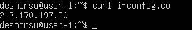

- для внутреннего

```
ip route
```

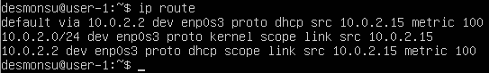

- Для установки статического IP отредактируем файл /etc/netplan/00-installer-config.yaml с помощью vim.
- Отключим DHCP, установим адрес локальной сети, внутренний IP и публичные серверы в параметре addresses.

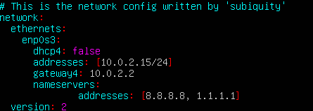

- Перезапустим машину, проверим, что настройки сохранились

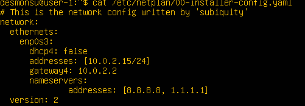

- Пинганем ip 1.1.1.1 и ya.ru

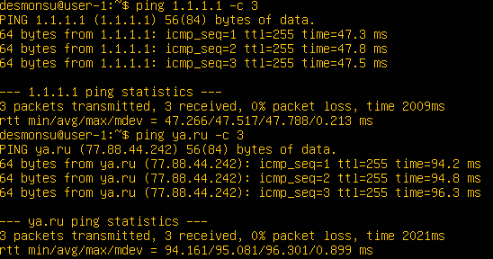

- Как видим на скриншоте, 3 пакета были направлены и все три были получены. Потерь пакетов не наблюдается.

## Part 4 Обновление ОС

- Запустим команду

```
sudo apt update
```

- За ней

```
sudo apt full-upgrade
```

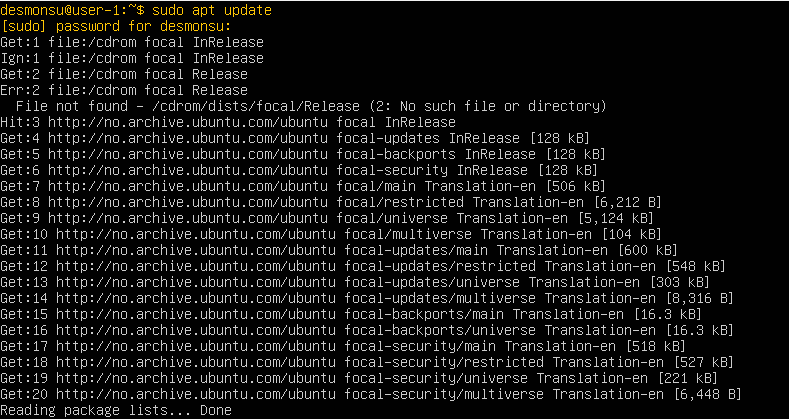

- Подождем обновления

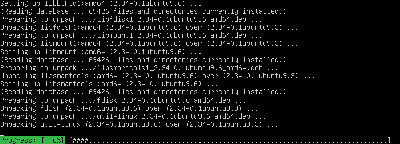

- И повторим команду sudo apt update

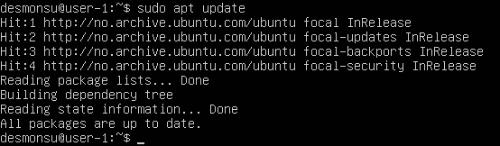

## Part 5 Использование команды Sudo

- Добавим пользователя newdesmonsu в группу sudo командой

```
sudo usermod -a -G -sudo newdesmonsu
```

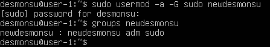

- Сменим пользователя командой

```
su newdesmonsu
```

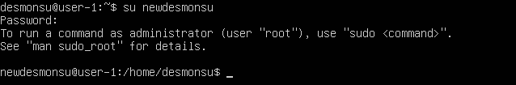

- Из под нового пользователя сменим имя машины с использованием команды sudo

```
sudo hostnamectl set_hostname user-2
```

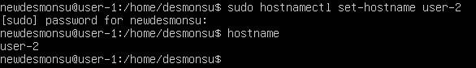

- Перезапустим машину, чтобы проверить сохранились ли настройки

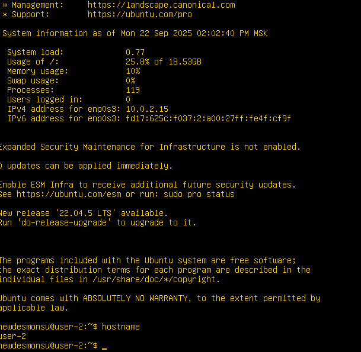

> sudo (substitute user and do) - это команда, которая позволяет разрешенным пользователям выполнять команды от имени другого пользователя, чаще всего от имени суперпользователя (root), не зная пароля root. Это основной и рекомендуемый способ выполнения административных задач.

## Part 6. Установка и настройка службы времени

- Запустим команду

```
timedatectl show
```

- Убедимся, что синхронизация включена

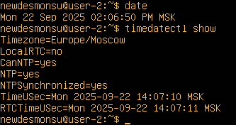

## Part 7. Установка и использование текстовых редакторов

- Введем команды установки текстовых редакторов: vim, nano, mcedit

```
sudo apt install vim
```

```
sudo apt install nano
```

```
sudo apt install mcedit
```

- Зайдем в первый редактор - vim с помощью команды

```
vim test_vim.txt
```

- Нажмем клавишу i, чтобы перейти в режим редактирования файла (Insert). Введем свой логин.


- Для выхода с сохранением необходимо нажать ESC, чтобы выйти из режима вставки, нажать комбинацию клавиш :wq (write и quit).

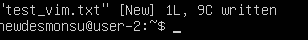

- Зайдем во второй редактор - nano с помощью команды

```
nano test_nano.txt
```

- Введем свой логин.

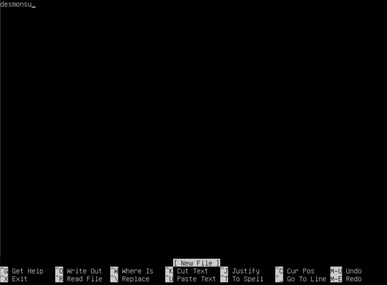

- Для выхода с сохранением необходимо нажать комбинации клавиш Ctrl+S и Ctrl+X.

- Зайдем в третий редактор - mcedit с помощью команды

```
mcedit test_nano.txt
```

- Введем свой логин.

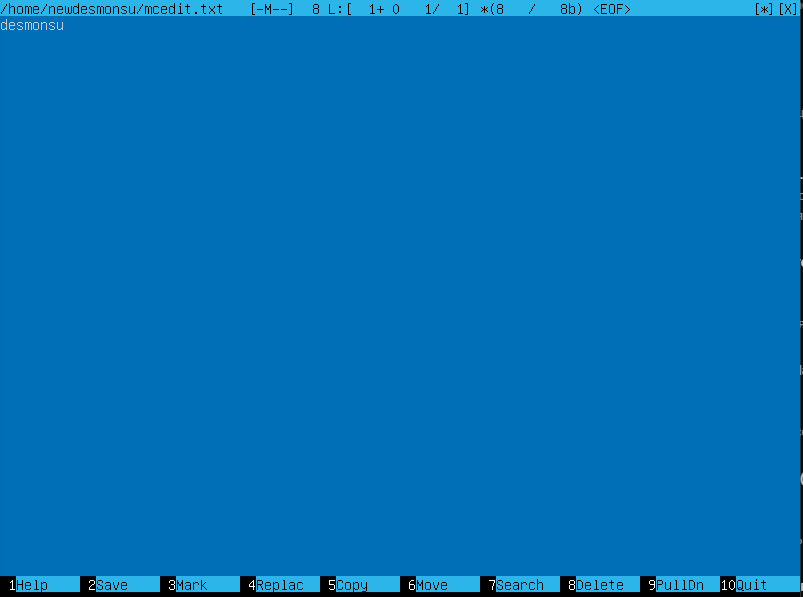

- Для выхода с сохранением необходимо нажать клавишу F10 и выбрать Yes во всплывающем окне.

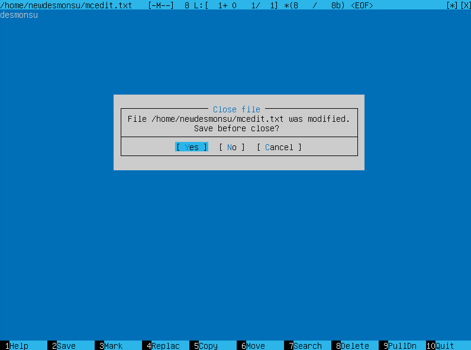

- Снова зайдем в Vim, заменим свой логин на текст 21 school 21.


- Чтобы выйти из файла без сохранения нужно ввести команду :q! (Форсированный выход). Проверим, что сохранения не произошло


- Зайдем в nano и также заменим текст.

- Чтобы выйти из файла без сохранения нужно нажать сочетание клавиш Ctrl+X и отказаться от сохранения буфера.


- Проверим, что сохранения не произошло

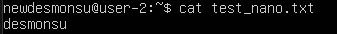

- Повторим то же в mcedit.

- Чтобы выйти из файла без сохранения нужно нажать клавишу F10 и отказаться от сохранения файла.

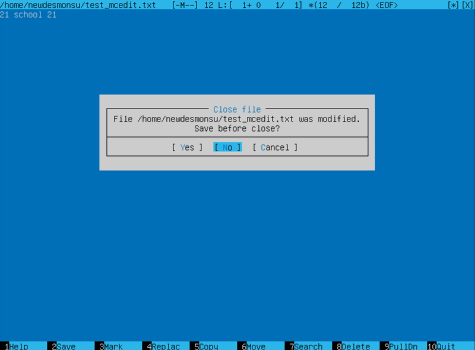

- Проверим, что сохранения не произошло


- Снова зайдем в Vim и повторно внесем изменения. Для поиска слова в файле наберем в командной строке /{искомое слово}


- Для замены слова напишем следующее: s/{искомое слово}/{слово для замены}


- Для поиска слова в редакторе nano используется комбинация Ctrl + W

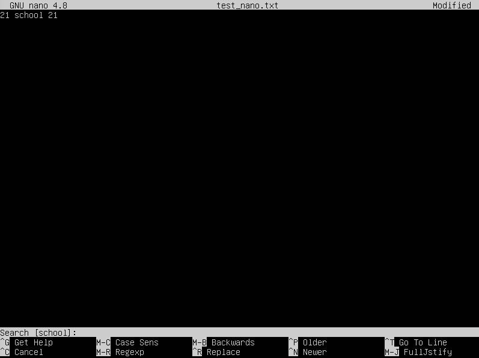

- Для замены - Ctrl + \

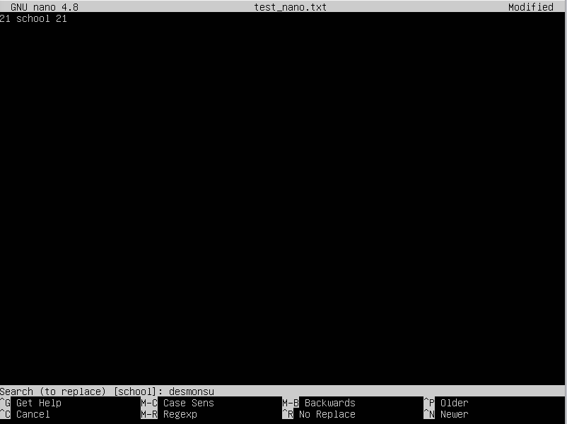

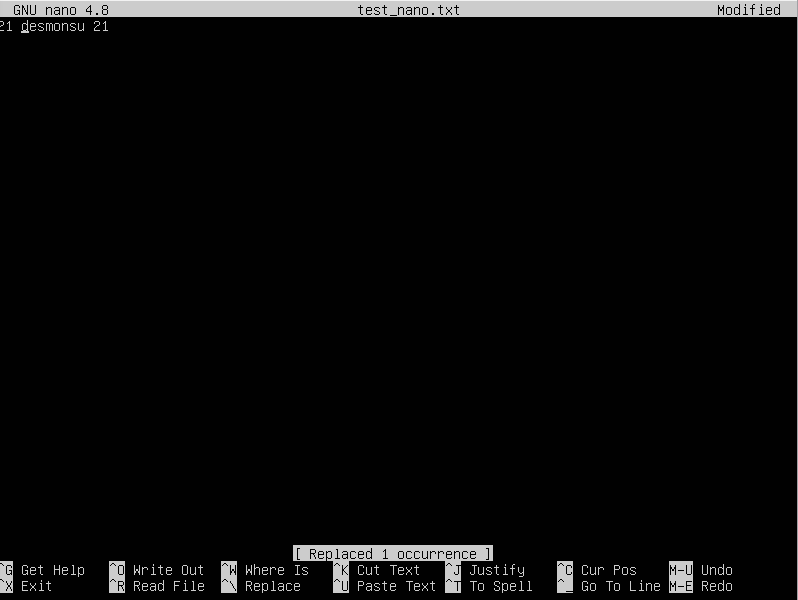

- Для поиска в mcedit нажнем клавишу F7

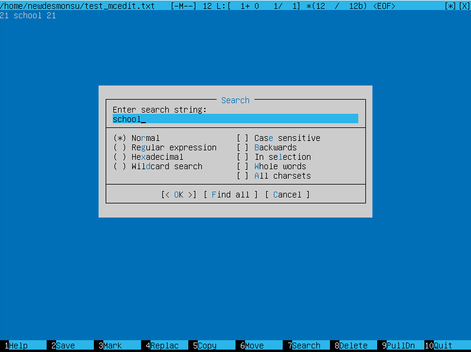

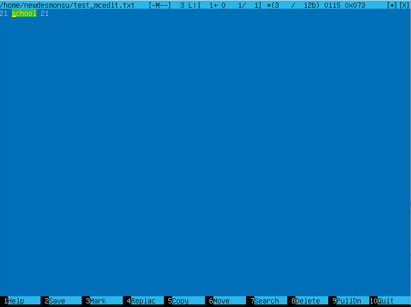

- Для замены нажмем клавишу F4

- Вводим слово для замены и подтверждаем

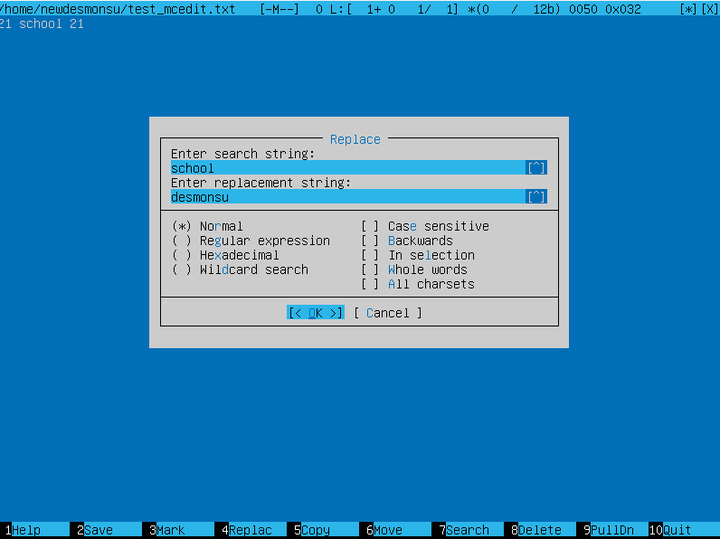

- Подтверждаем замену одного (replase) или всех (all) совпадений

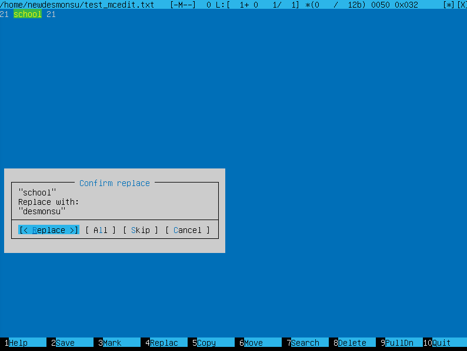

- Получаем результат

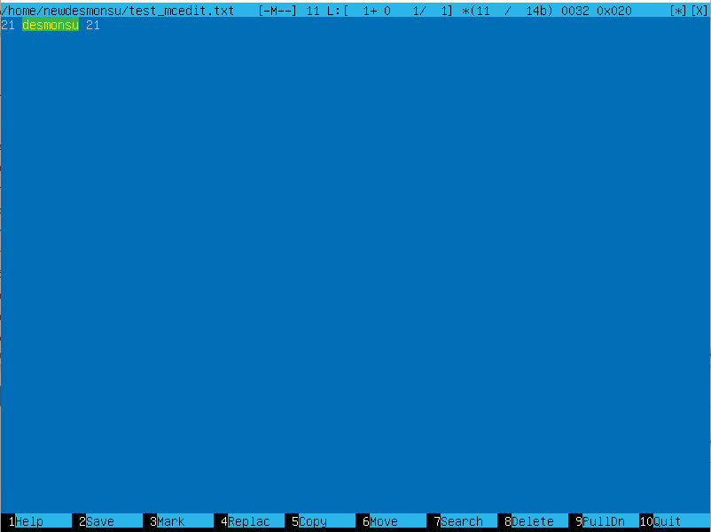

## Part 8. Установка и базовая настройка сервиса SSHD

- Установим службу SSHd с помощью команды:

```
sudo apt install openssh-server
```

- Узнаем состояние SSHd службы, воспользовавшись командой:

```
sudo systemctl status ssh
```

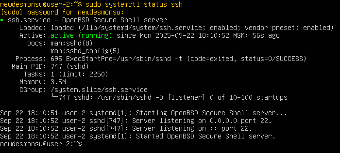

- Для перенастройки службы SSHd на порт 2022 откроем файл sshd_config командой

```
sudo vim /etc/ssh/sshd_config
```

- Раскомментируем строчку с портом и заменим его на 2022

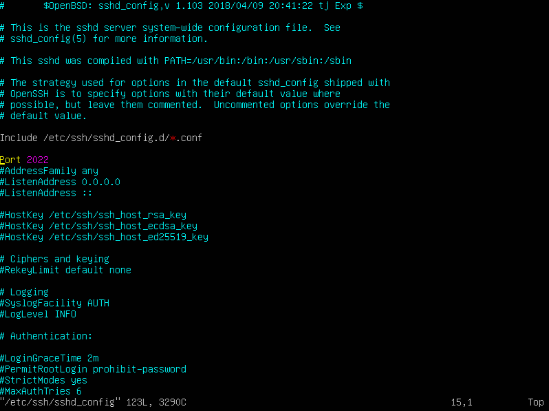

- Чтобы применить внесенные изменения перезапустим службу ssh

```
sudo systemctl restart ssh
```

- Проверим изменился ли порт?

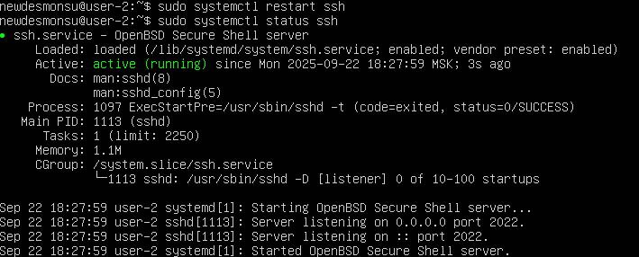

- На скриншоте видно, что порт соответствует заданному

- Разрешим брендмауеру принимать входящие запросы от всех адресов, иначе он будет блокировать все попытки подключения. Сделать это можно командой

```
sudo ufw allow 2022/tcp
```

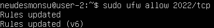

- Проверим наличие процесса sshd, используя команду

```
ps aux | grep -i ssh
```

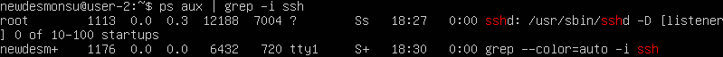

> ps (process status) - утилита для просмотра списка процессов в Linux. Она показывает статическое состояние процессов, запущенных на момент выполнения команды. <br>
> Ключевые параметры:<br>
> -a - процессы всех пользователей<br>
> -u - пользовательско-ориентированный формат<br>
> -x - позволяет ps перечислить процессы не привязанные к управляющему терминалу<br>
> grep -i ssh - выводит строчки, где есть ssh с игнорированием регистра<br>
> | - pipe (конвейер) перенаправляет вывод одной команды в стандартный ввод другой

- Выполним перезагрузку машины с помощью команды reboot и выполним команду

```
netstat -tan
```

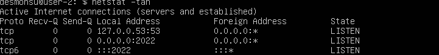

- Вывод команды содержит tcp 0 0 0.0.0.0:2022 0.0.0.0:\* LISTEN

> Команда netstat (network statistics) - это инструмент командной строки, который отображает сетевые соединения, таблицы маршрутизации, статистику интерфейсов, маскирующие соединения и членство в мультикаст-группах.
> -t - отображает TCP-соединения
> -a - вывод всех активных подключений TCP и прослушиваемых портов TCP и UDP.
> -n - отображает числовые адреса вместо разрешения хостов и имен служб

> Привызове команды в терминал выводится таблица со следующими полями:
>
> - Proto (protocol) - сетевой протокол (tcp, udp);
> - Recv-Q (recieve queue) - количество байт, помещенных в буфер приема, еще не прочитанных процессом
> - Send-Q (send queue) - количество байт в очереди на отправку, еще не подтвержденных удаленной стороной
> - Local Address - Адрес и порт локальной машины
>   Значение 0.0.0.0 в этом контексте означет, что служба готова принять подключение на любой свой сетевой интерфейс
> - Foreign Adress - Адрес и порт удаленной машины
>   Значение 0.0.0.0 в этом контексте означет, что служба готова принять подключение с любого сетевого интерфейса и любого IP-адреса в сети
> - State - Состояние соединения

## Part 9. Установка и использование утилит top, htop

- Введем в консоль команду top, она выводит на экран

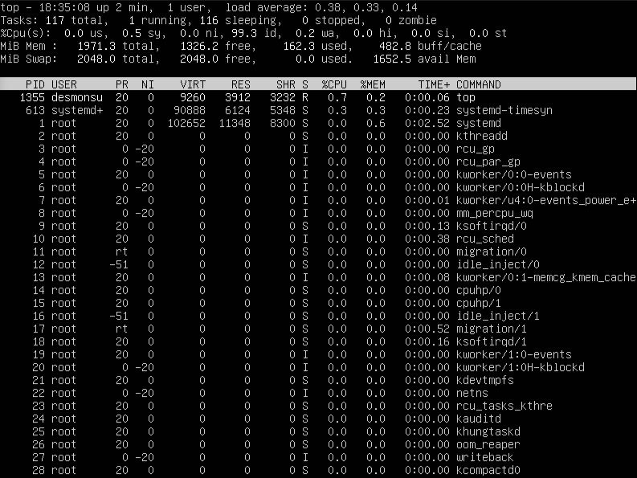

> Uptime - 2 минуты<br>
> Количество авторизированных пользователей - 1 пользователь.<br>
> Средняя загрузка системы - 0.38 за одну минуту, 0.33 за пять минут, 0.14 за 15 минут.<br>
> Общее количество процессов - 117.<br>
> Загрузка cpu - 0.07 (0.05 - системные процессы, 0.02 - ожидание i/o операций, 99.3 - простой).<br>
> Загрузка памяти - 162.3 из 1971.3.<br>
> Pid процесса, занимающего больше всего памяти - 1.<br>
> Pid процесса, занимающего больше всего процессорного времени - 1355.<br>

- Вывод команды htop без сортировки

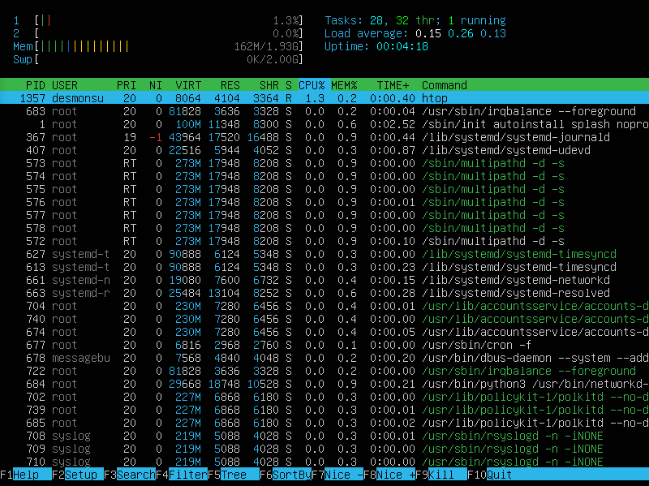

- Отсортируем вывод команды. Для этого нажнеи на клавишу F6 и выберем параметр сортировки.

- По PID

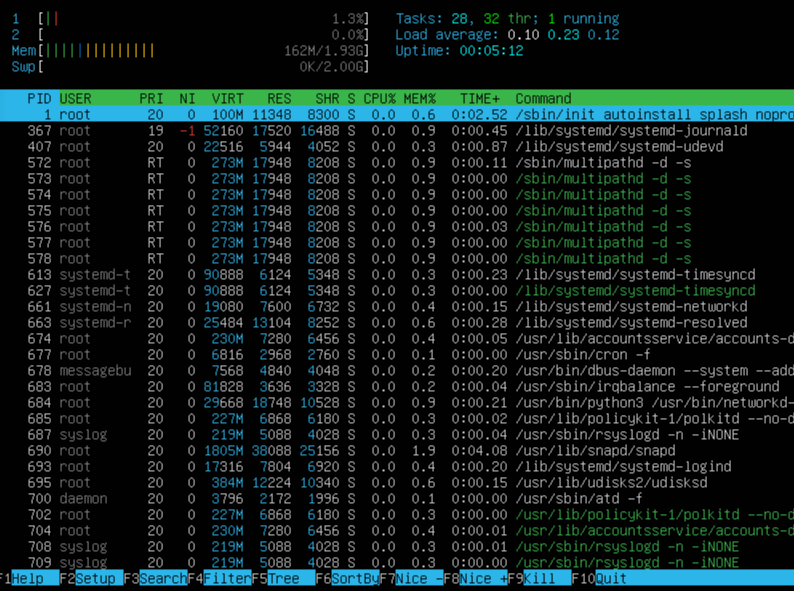

- PERCENT_CPU

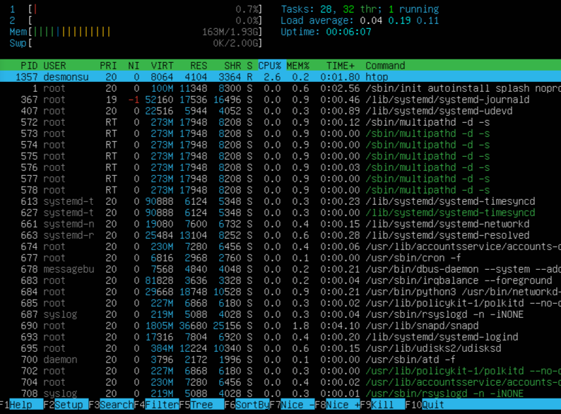

- PERCENT_MEM

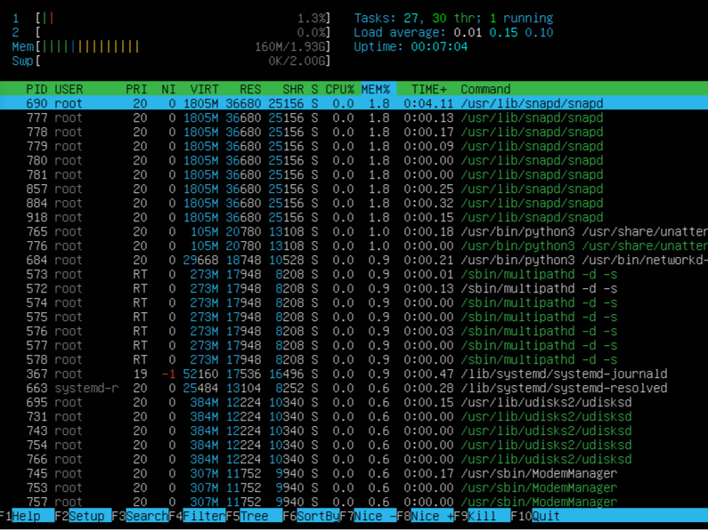

- TIME

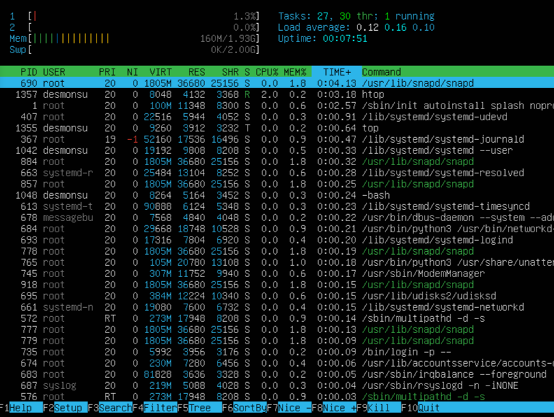

- Для использования фильтров необходимо нажать клавишу F4 и ввести параметр фильтрации. htop отфильтрованный по sshd

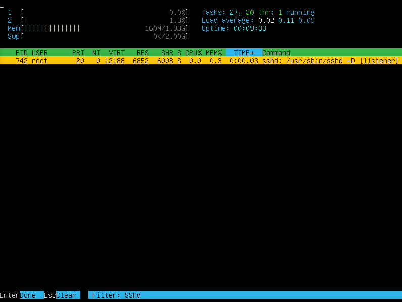

- Для поиска необходимо нажать клавишу F3 и ввести искомую строку, например syslog.

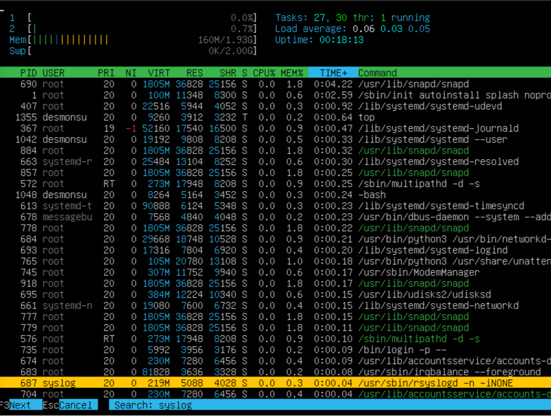

- Для отображения дополнительных переметров нужно нажать клавишу F2 и выбрать нужные.

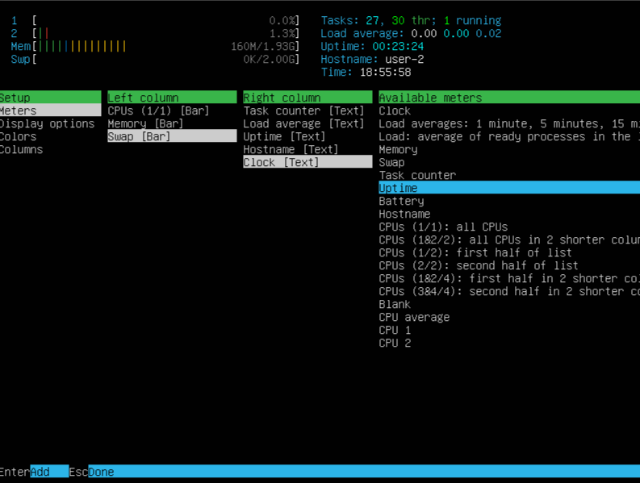

## Part 10. Использование утилиты fdisk

- Выполним команду:

```
fdisk -l
```

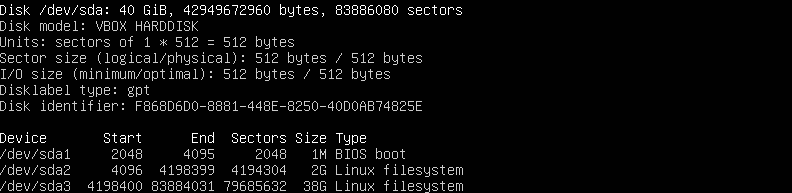

> Название диска - VBOXHARDDISK<br>
> Размер диска - 40 GB<br>
> Количество секторов - 83886080<br>

- Чтобы узнать размер swap выполним команду:

```
free -h
```


- Размер swap - 2.0 GB

## Part 11. Использование утилиты df

- Выполним команды

```
df
```

- и для вывода корневого раздела

```
df /
```

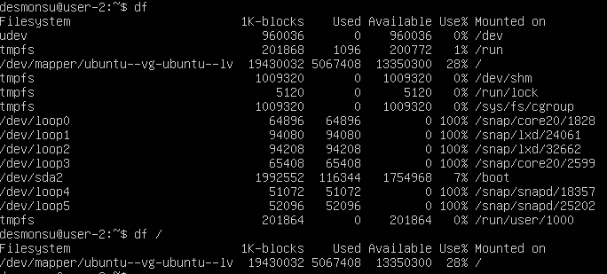

> Размер корневого раздела: 19430032<br>
> Размер занятого пространства: 5067408<br>
> Размер свободного пространства: 13350300<br>
> Процент использования: 28%<br>
> Единицы измерения при выводе - килобайты<br>

- Выполним команду:

```
df -Th
```

- и для вывода корневого раздела

```
df -Th /
```


> Размер корневого раздела: 19G<br>
> Размер занятого пространства: 4.9G<br>
> Размер свободного пространства: 13G<br>
> Процент использования: 28%<br>
> Единицы измерения при выводе - гигабайты<br>

> Тип файловой системы (Fourth Extended File System) - ext4 - это современная журналируемая файловая система для Linux, пришедшая на смену ext3. В ссравнении с ext3 увеличено адресное пространсство и значительно увеличена скорость работы с данными.

## Part 12. Использование утилиты du

- Выполним команду

```
du
```

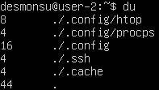

- Вывод размера папки home в бвйтах и человекочитаемом виде

```
sudo du -s /home/
```

```
sudo du -sh /home/
```

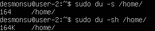

- Вывод размера папки /var в бвйтах и человекочитаемом виде

```
sudo du -s /var/
```

```
sudo du -sh /var/
```

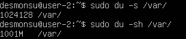

- Вывод размера папки /var/log в бвйтах и человекочитаемом виде

```
sudo du -s /var/log/
```

```
sudo du -sh /var/log/
```

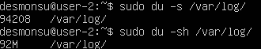

- Вывод размеров содержимого папки /var/log/\*

```
sudo du var/log/* | less
```

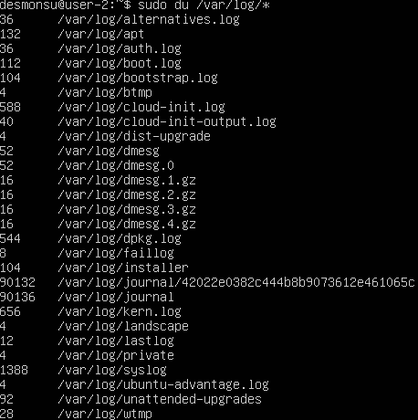

## Part 13. Установка и использование утилиты ncdu

- Установим утилиту ncdu

```
sudo apt install ncdu
```

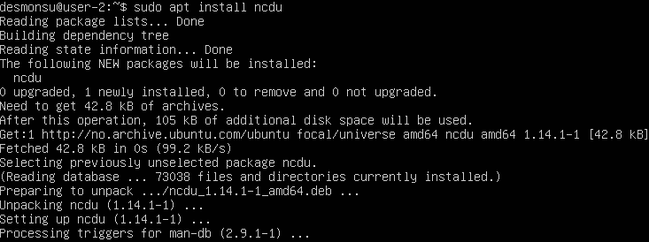

- Выведем размер папки /home:

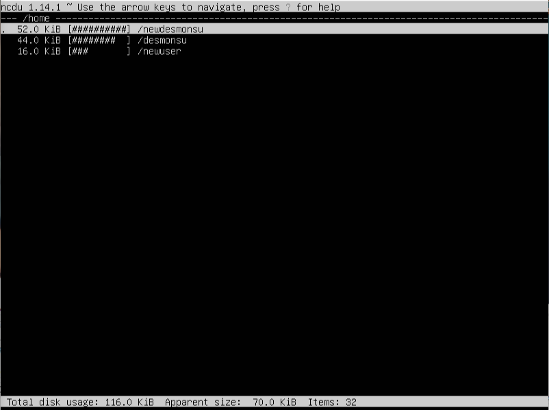

- папки /var:

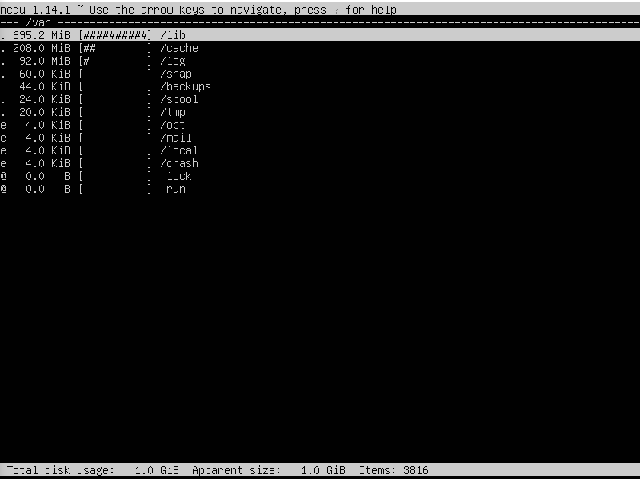

- и подпапки /var/log:

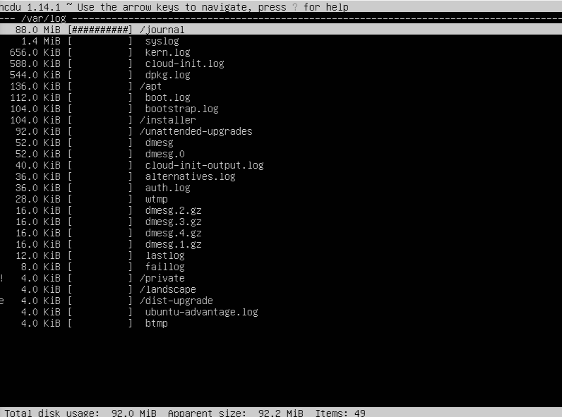

- Размеры совпадают с размерами из 12 части.

## Part 14. Работа с системными журналами

- Откроем для просмотра файл /var/log/dmesg

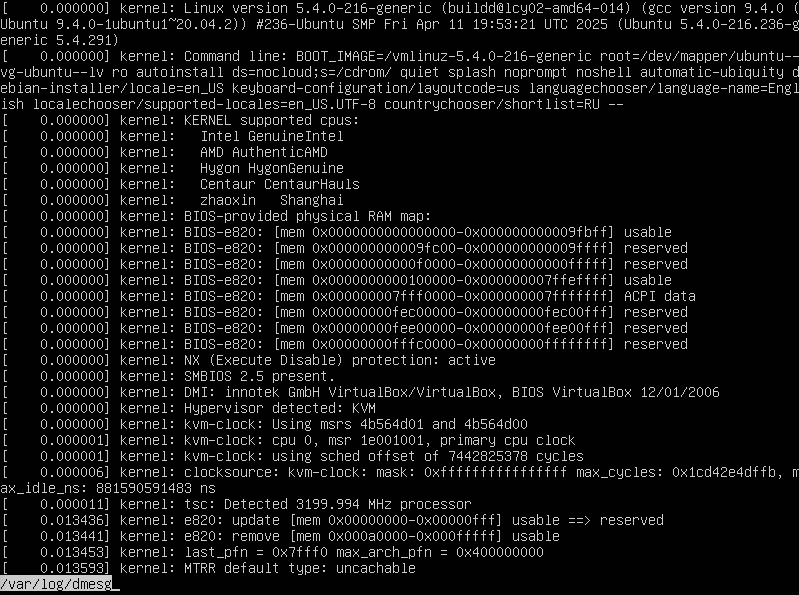

- файл /var/log/syslog

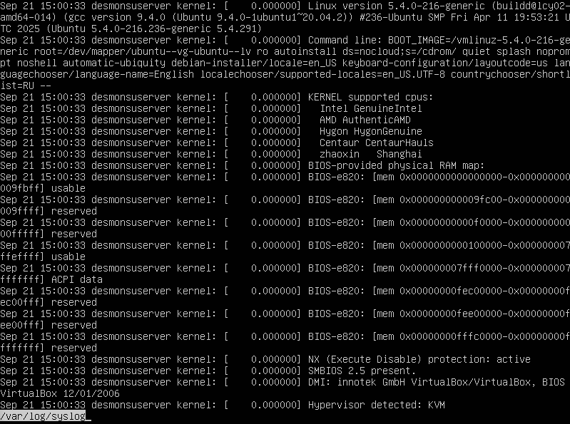

- и /var/log/auth.log

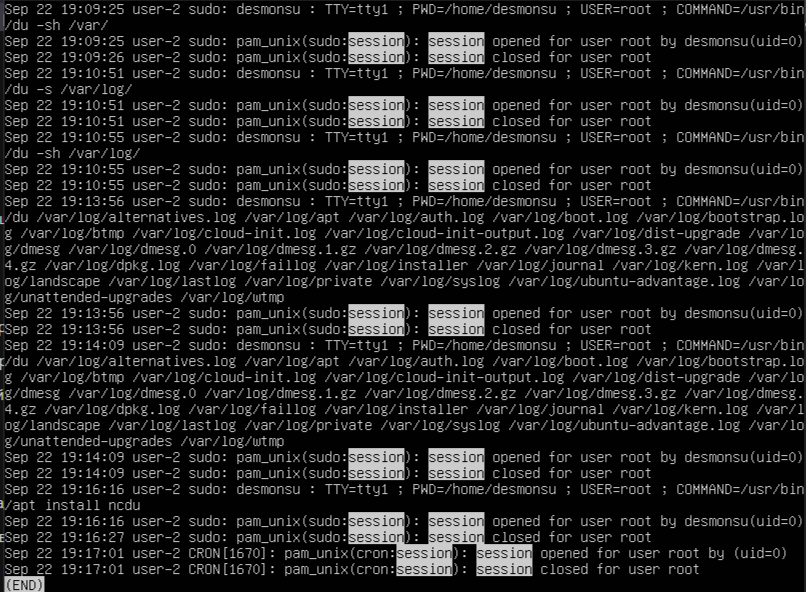

- Время последней успешной авторизации - Sep 22 19:17:01
- Имя пользователя: отсутствует (CRON)
- Метод входа в систему: by uid = 0 (User Identifier)

- Время последней успешной авторизации пользователя - Sep 22 19:16:16
- Имя пользователя: desmonsu
- Метод входа в систему: by uid = 0 (User Identifier).

- Перезапустим службу SSHd с помощью команды

```
sudo systemctl restart ssh
```

- и найдем сообщение о перезапуске службы

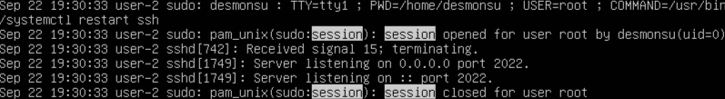

## Part 15. Использование планировщика заданий CRON

- Запустим команду uptime с выводом в файл через каждые 2 минуты.

```
crontab -e
```

- Добавим строчку _/2 _ \* \* \* uptime >> /tmp/uptime.log 2>&1

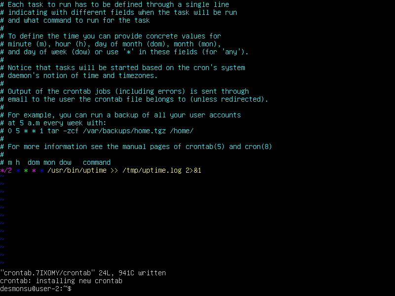

- Сохраним и закроем файл.

- Откроем файл лога.

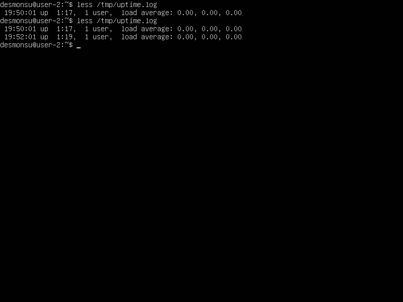

- Выведем список заданий для CRON

```
crontab -l
```

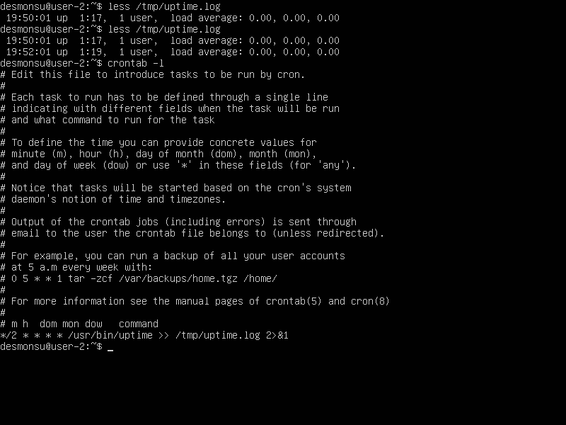

- Очистим список заданий

```
crontab -r
```

- Повторно проверим вывод

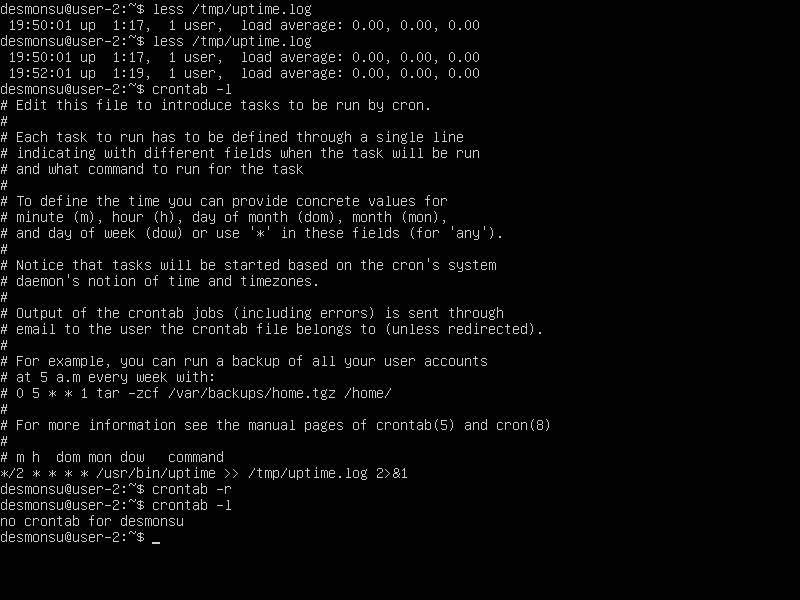
