# Отчет по выполнению задания DO2_LinuxNetwork

1. [Part 1. Инструмент ipcalc](#part-1-инструмент-ipcalc)
   - [Part 1.1. Сети и маски](#part-11-сети-и-маски)
   - [Part 1.2. localhost](#part-12-localhost)
   - [Paer 1.3. Диапазоны и сегменты сетей](#part-13-диапазоны-и-сегменты-сетей)
2. [Part 2. Статистическая маршрутизация между двумя машинами](#part-2-статистическая-маршрутизация-между-двумя-машинами)
   - [Part 2.1. Добавление статического маршрута вручную](#part-21-добавление-статического-маршрута-вручную)
   - [Part 2.2. Добавление статического маршрута с сохранением](#part-22-добавление-статического-маршрута-с-сохранением)
3. [Part 3. Утилита iperf3](#part-3-утилита-iperf3)
   - [Part 3.1. Скорость соединения](#part-31-скорость-соединения)
   - [Part 3.2. Утилита iperf3](#part-32-утилита-iperf3)
4. [Part 4. Сетевой экран](#part-4-сетевой-экран)
   - [Part 4.1. Утилита iptables](#part-41-утилита-iptables)
   - [Part 4.2. Утилита nmap](#part-42-утилита-nmap)
5. [Part 5. Статическая маршрутизация сети](#part-5-статическая-маршрутизация-сети)
   - [Part 5.1. Настройка адресов машин](#part-51-настройка-адресов-машин)
   - [Part 5.2. Включение переадресации IP адресов](#part-52-включение-переадресации-ip-адресов)
   - [Part 5.3. Установка маршрута по умолчанию](#part-53-установка-маршрута-по-умолчанию)
   - [Part 5.4. Добавление статических маршрутов](#part-54-добавление-статических-маршрутов)
   - [Part 5.5. Построение списка маршрутизаторов](#part-55-построение-списка-маршрутизаторов)
   - [Part 5.6. Использование протокола ICMP при маршрутизации](#part-56-использование-протокола-icmp-при-маршрутизации)
6. [Part 6. Динамическая настройка IP с помощью DHCP](#part-6-динамическая-настройка-ip-с-помощью-dhcp)
7. [Part 7. NAT](#part-7-nat)

<br>

## Part 1. Инструмент ipcalc

### Part 1.1. Сети и маски

- для начала работы поднимем машину и установим утилиту

```
sudo apt install ipcalc
```

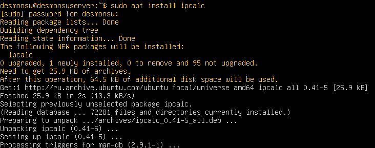<br>
Рис. 1.1. Установка ipcalc

- Для расчета адреса сети 192.167.38.54.13 введем команду

```
ipcalc 192.167.38.54/13
```

- Рассмотрим вывод команды

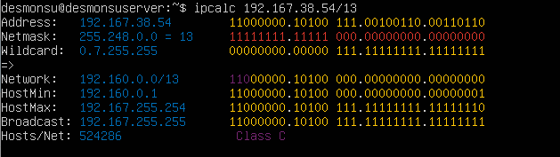<br>
Рис. 1.2. Рассчет IP

- Теперь переведем маску 255.255.255.0 в префиксную и двоичную записи

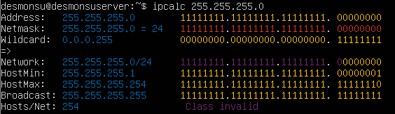<br>
Рис. 1.3. Рассчет обычной маски

- префиксную запись /15 в обычную и двоичную

<br>
Рис. 1.4. Рассчет префиксной маски

- двоичную 11111111.11111111.11111111.11110000 в обычную и префиксную.
- утилита ipcalc не работает с двоичной маской напрямую. Для того, чтобы рассчитать ее подсчитаем количество единиц в маске (28) и выведем префиксную форму /28

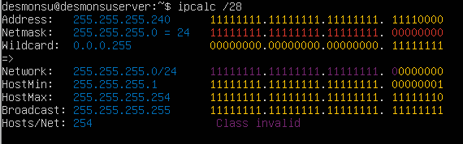<br>
Рис. 1.5. Рассчет бинарной маски

- найдем минимального и максимального хоста в сети 12.167.38.4
- при масках /8

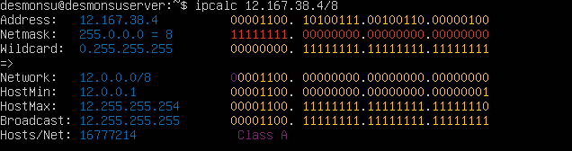<br>
Рис. 1.6. Рассчет маски 8 бит

- Минимальный - 12.0.0.1
- Максимальный - 12.255.255.254

- /16. Для определения маски подсчитаем количество единиц

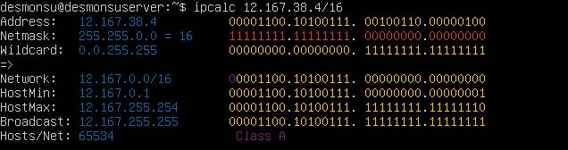<br>
Рис. 1.7. Рассчет маски 16 бит

- Минимальный - 12.167.0.1
- Максимальный - 12.167.255.254

- /24. Для определения этой маски вызовем утилиту ipcalc.

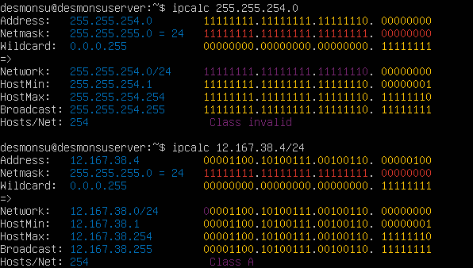<br>
Рис. 1.8. Рассчет маски 24 бит

- Минимальный - 12.167.38.1
- Максимальный - 12.167.38.254

- и /4

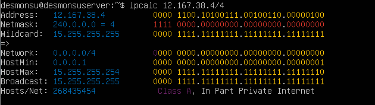<br>
Рис. 1.9. Рассчет маски 4 бит

- Минимальный - 0.0.0.1
- Максимальный - 15.255.255.254

- для всех случаев последний адрес в подсети (в наших конкретных случаях .255) - широковещательный адрес, который не может являться обычным хостом.

### Part 1.2. localhost

- Для всех компьютеров localhost реализован через сеть 127.0.0.0/8 и любой адрес из этого диапазона отправляет трафик на машину, с которой был отправлен.

- Рассчитаем диапазон хостов возможных для localhost командой

```
ipcalc 127.0.0.0/8
```

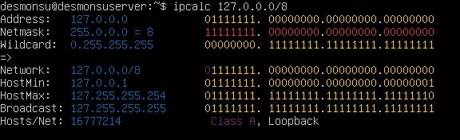<br>
Рис. 1.10. Рассчет localhost

- Как мы видим минимальный адрес в loopback-сети 127.0.0.1
- Максимальный - 127.255.255.254

- Соотнесем их с адресами из задания:

- 194.34.23.100 - не принадлежит loopback-сети
- 127.0.0.2 - принадлежит loopback-сети
- 127.1.0.1 - принадлежит loopback-сети
- 128.0.0.1 - не принадлежит loopback-сети

### Part 1.3. Диапазоны и сегменты сетей

- К частным сетям относятся сети в диапазонах

1. 10.0.0.0/8 `(10.*.*.*)` - (16777216 хостов)
2. 172.16.0.0/12 `(172.16.0.0-172.31.255.255)` - (1048576 хостов)
3. 192.168.0.0/16 `(192.168.*.*)` - (65536 хостов)

- Соответственно к частным сетям относятся:
- 10.0.0.45
- 192.168.4.2
- 172.20.250.4
- 172.16.255.255
- 10.10.10.10

- К публичным адресам относятся все остальные:
- 134.43.0.2
- 172.0.2.1
- 192.172.0.1
- 172.68.0.2
- 192.169.168.1

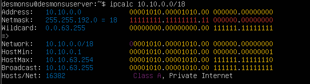<br>
Рис. 1.11. Рассчет шлюзов

- Минимальный адрес в сети 10.10.0.1
- Максимальный - 10.10.63.254

- Соотнесем их с адресами из задания:

- 10.0.0.1 - не принадлежит сети
- 10.10.0.2 - принадлежит сети
- 10.10.10.10 - принадлежит сети
- 10.10.100.1 - не принадлежит сети
- 10.10.1.255 - принадлежит сети

## Part 2. Статистическая маршрутизация между двумя машинами

- Поднимем вторую виртуальную машину и в обеих вызовем команду

```
ip a
```

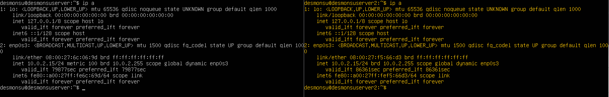<br>
Рис. 2.1. Вызов ip a для обеих машин

- Интерфейсы enp0s3 - на обеих машинах
- Текущий адрес DHCP 10.0.2.15/24 - на обеих машинах
- Зададим машинам адреса согласно заданию

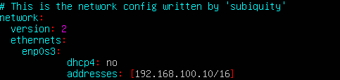<br>
Рис. 2.2. Адрес ws1<br>
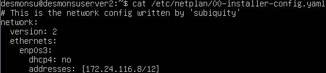<br>
Рис. 2.3. Адрес ws2

- Сохраним изменения, применим команду

```
sudo netplan apply
```

- и повторно вызовем команду

```
ip a
```

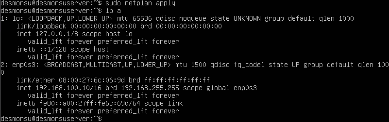 <br>
Рис. 2.4. Обновленный адрес ws1<br>
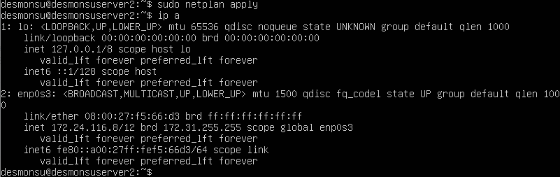<br>
Рис. 2.5. Обновленный адрес ws2<br>

- Убедимся, что измение адресов сохранилось

### Part 2.1. Добавление статического маршрута вручную

- Чтобы добавить статический маршрут в консоли обеих машин введем команду

```
sudo ip r add {ip-адрес наших машин} (первый адрес для второй и наоборот) dev enp0s3
```

- И затем пропингуем машины

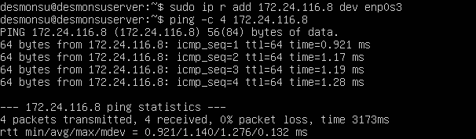 <br>
Рис. 2.6. Пинг второй машины<br>
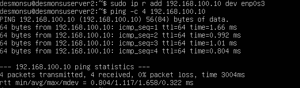<br>
Рис. 2.7. Пинг первой машины<br>

- Соединение есть, а потеря пакетов отсутствует

### Part 2.2. Добавление статического маршрута с сохранением

- Перезапустим вируальные машины

- Добавим статические маршруты в netplan обеих наших машин

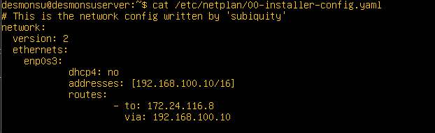 <br>
Рис. 2.8. Статический путь на первой машине<br>
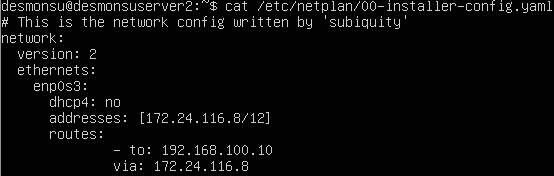<br>
Рис. 2.9. Статический путь на второй машине<br>

- применим настройки и пропингуем их снова

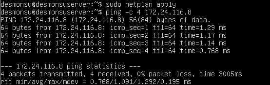 <br>
Рис. 2.10. Пинг статического пути на первой машине<br>
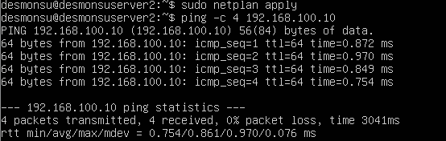<br>
Рис. 2.11. Пинг статического пути на второй машине<br>

## Part 3. Утилита iperf3

### Part 3.1. Скорость соединения

- Для перевод бита в байт нужно раделить количество бит на 8
- Для перевода значений между префиксами в контексте скорости передачи данных используются десятичные приставки, то есть 1 Килобит/c = 1000 бит/c. В соответствии с этим найдем значения данных указанных в задании:

- 8Mbps = ? MB/s

  - Разделим левое значение на 8 и получим значение в 1, значит 8Mbps = 1MB/s

- 100 MB/s = ? Kbps

  - Для определению правого значения сначала переведем левое в килобайты, умножив на 1000, и получим 100000 KB/s
  - Затем переведем килобайты в килобиты, умножив на 8. 100 MB/s = 800000 Kbps, что и требовалось найти

- 1 Gbps = ? Mbps

  - Переведем Гигабиты в мегабиты путем умножения на 1000 и получим искомый результат. 1 Gbps = 1000 Mbps

- Как можно заметить для определения скорости передачи в битах используется малая b и буква p вместо косой черты. Это исторически сложившееся различие, помогающее быстро и точно определить в каких единицах измеряются величины.

### Part 3.2. Утилита iperf3

- Утилита iperf3 - утилита предназначенная для тестирования пропускной способности сети. Она позволяет определить пропускную способность между двумя узлами сети при помощи генерации TCP и UDP трафика.

- Для определения пропускной способности сети запустим утилиту в качестве сервера на второй машине командой

```
iperf3 -s
```

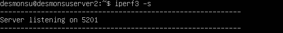 <br>
Рис. 3.1. Запуск сервера iperf3<br>

- Теперь с первой машины пустим трафик в сторону второй машины командой

```
iperf3 -c 172.24.116.8
```

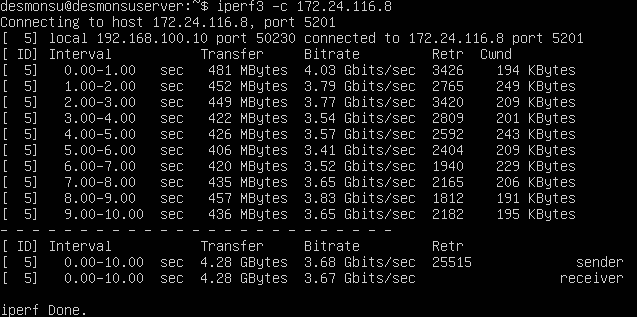 <br>
Рис. 3.2. Результат выполнения на стороне клиента<br>
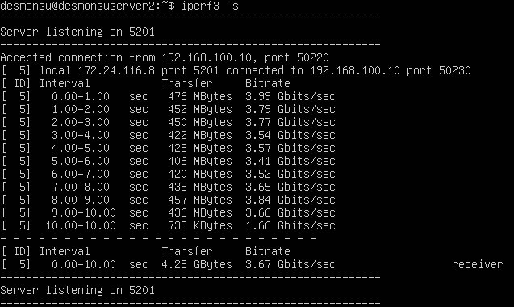 <br>
Рис. 3.3. Результат выполнения на стороне сервера<br>

- На скриншотах видим результаты вызова одной команды на обоих узлах

## Part 4. Сетевой экран

### Part 4.1. Утилита iptables

- На обеих машинах создадим файл, имитирующий файервол командой

```
sudo vim /etc/firewall.sh
```

- и добавим в них правила соответствующие заданию.

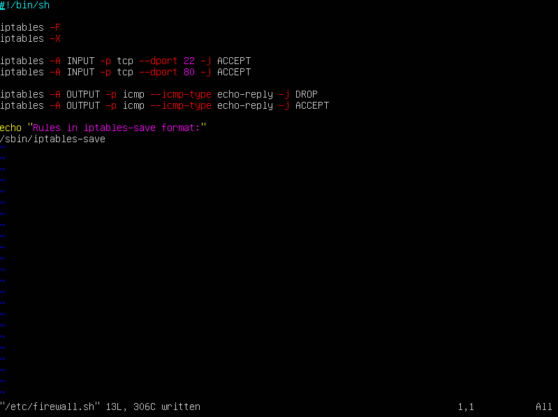 <br>
Рис. 4.1. Файервол на первой машине<br>
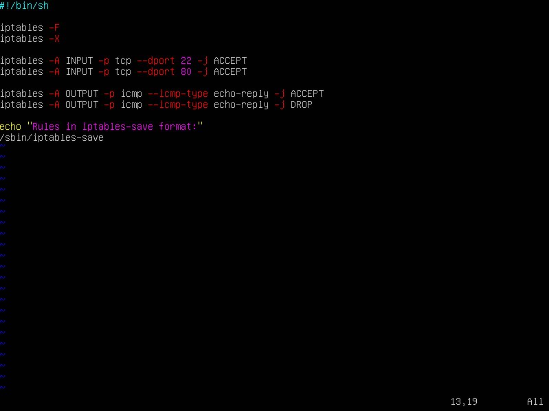 <br>
Рис. 4.2. Файервол на второй машине<br>

- Дадим файерволам возможность выполняться командой

```
chmod +x /etc/firewall.sh
```

- и запустим

```
/etc/firewall.sh
```

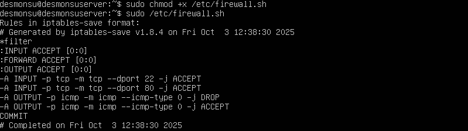 <br>
Рис. 4.3. Запуск файервола на первой машине<br>
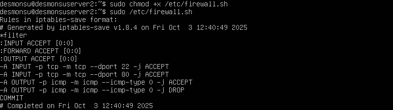 <br>
Рис. 4.4. Запуск файервола на второй машине<br>

- Разница между стратегиями заключается в порядке обработки правил межсетевым экраном. Важно отметить, что стратегии читаются сверху вниз, то есть работает только первая соответствующая стратегия. Первая стратегия запрещает все, что явно не разрешено, а вторая наоборот разрешает все, что явно не запрещено. В контексте задания мы задали правила, относящиеся к ответам на пинги. Весь остальной трафик обрабатывается согласно стратегии по умолчанию. Первая машина никогда не ответит на пинг, а вторая ответит всегда. Таким образом можно добавлять правила ко всем типам траффика, в том числе менять стратегию по умолчанию. Запрещающая стратегия (по сути белый лист) более безопасна, но менее удобна, так как надо обработать все необходимые входящие способы взаимодействия. Вторая стратегия (черный лист) более удобна, но в то же время более опасна, так как может пропустить нежелательный трафик.

### Part 4.2. Утилита nmap

- Утилита nmap - это утилита командной строки предназначенная для исследования сетей и аудита безопасности.

- Попробуем пропинговать первую виртуальную машину со второй

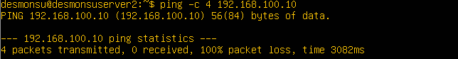 <br>
Рис. 4.5. Пинг машины под файерволом<br>

- Как видим ответа с первой машины не поступает. Проверим состояние хоста утилитой nmap

```
sudo nmap 192.168.100.10
```

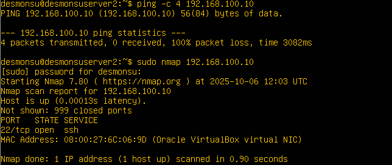 <br>
Рис. 4.6. Утилита nmap<br>

- Сохраним дампы виртуальных машин

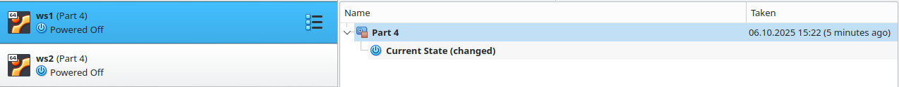 <br>
Рис. 4.7. Дампы виртуальных машин<br>

## Part 5. Статическая маршрутизация сети

- Поднимем 5 виртуальных машин: три рабочие станции и два роутера (ws11, ws21, ws22, r1, r2)

### Part 5.1. Настройка адресов машин

- Обновим конфигурацию файла /etc/netplan/00-installer-config.yaml на всех машинах

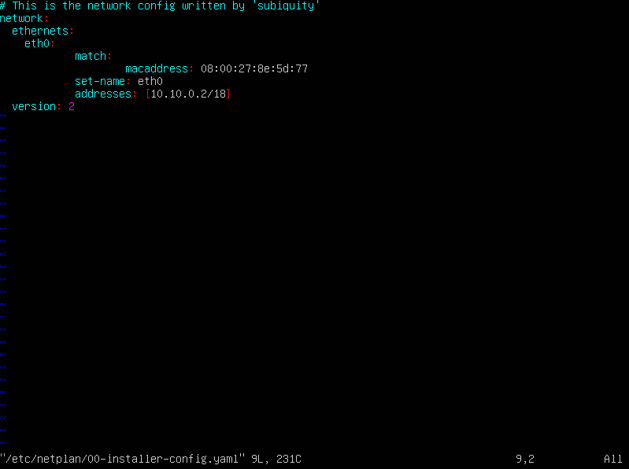 <br>
Рис. 5.1. Обновление netplan на первой машине<br>
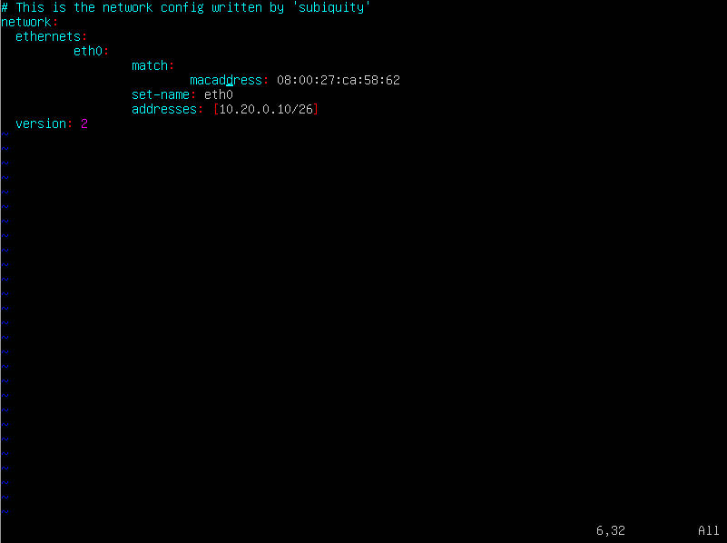 <br>
Рис. 5.2. Обновление netplan на второй машине<br>
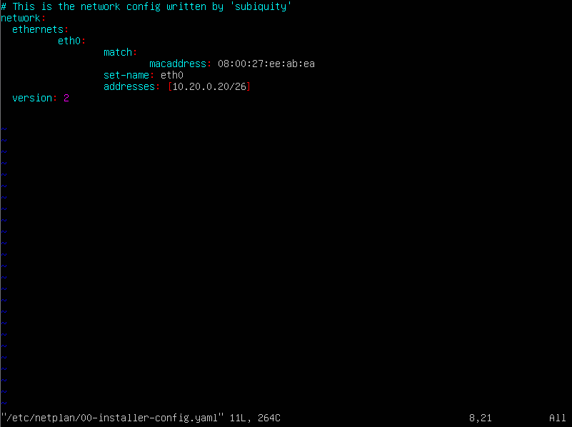 <br>
Рис. 5.3. Обновление netplan на третьей машине<br>
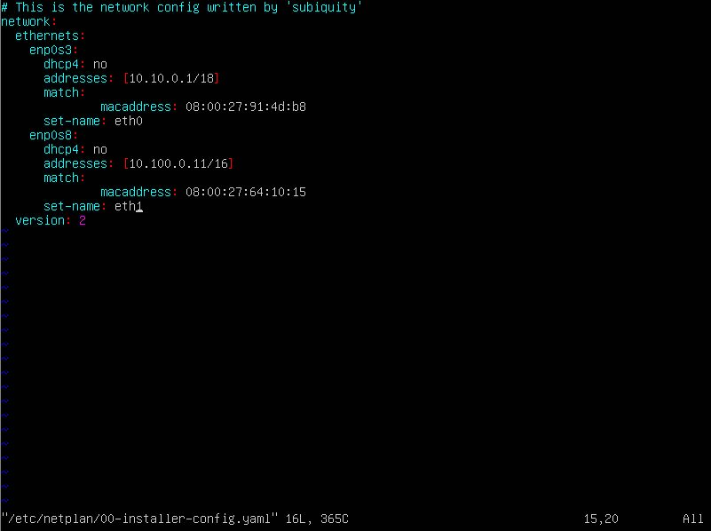 <br>
Рис. 5.4. Обновление netplan на четвертой машине<br>
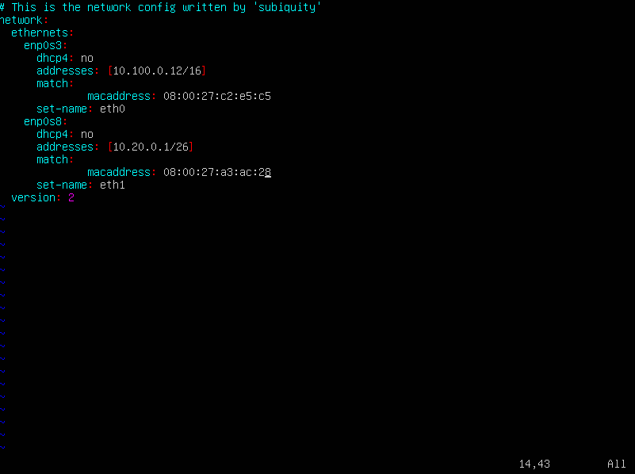 <br>
Рис. 5.5. Обновление netplan на пятой машине<br>

- Применим настройки и перезагрузим систему конфигурации сети командами

```
sudo netplan apply
sudo service systemd-networkd restart
```

 <br>
Рис. 5.6. Результат ввода команд<br>

- Видим, что ошибки отсутствуют. Командой ip -4 a проверяем, что адреса машин заданы верно

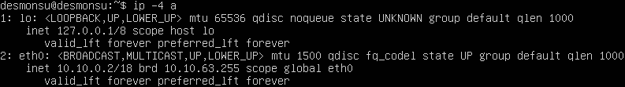 <br>
Рис. 5.7. Адрес на первой машине<br>
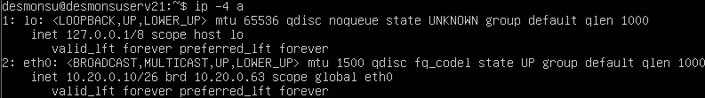 <br>
Рис. 5.8. Адрес на второй машине<br>
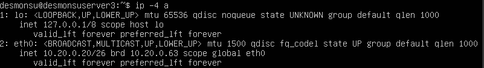 <br>
Рис. 5.9. Адрес на третьей машине<br>
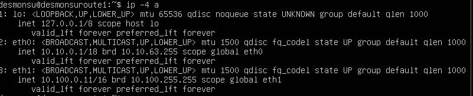 <br>
Рис. 5.10. Адрес на четвертой машине<br>
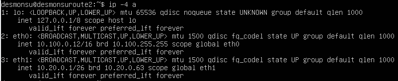 <br>
Рис. 5.11. Адрес на пятой машине<br>

- Пропингуем ws22 с ws21 и r1 с ws11 согласно заданию

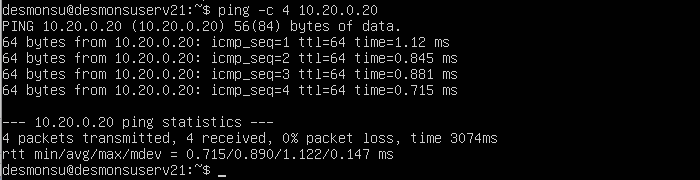 <br>
Рис. 5.12. Пинг станции ws22<br>
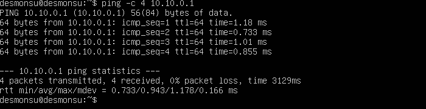 <br>
Рис. 5.13. Пинг первого роутера<br>

### Part 5.2. Включение переадресации IP адресов

- Включим на роутерах переадресацию командой

```
sysctl -w net.ipv4.ip_forward=1
```

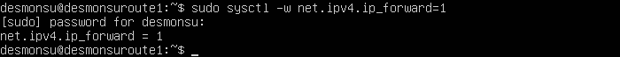 <br>
Рис. 5.14. Переадресация на первом роутере<br>
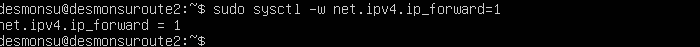 <br>
Рис. 5.15. Переадресация на втором роутере<br>

- Теперь переадресация будет работать до перезагрузки системы. Чтобы переадресация работала и после нужно внести изменения в файл /etc/sysctl.conf

- Зайдем в него На обеих машинах и раскомментируем следующую строчку:

```
net.ipv4.ip_forward=1
```

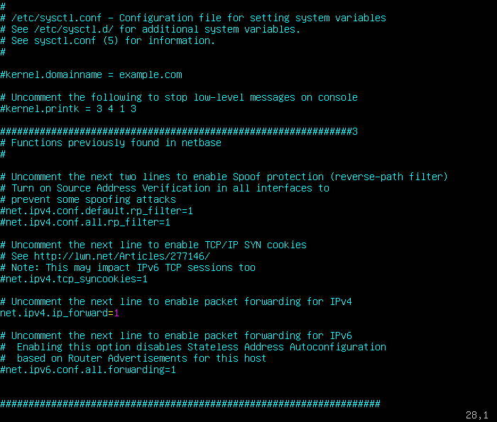 <br>
Рис. 5.16. Изменение файла конфигурации на роутере<br>

- При использовании этого подхода переадресация работает на постоянной основе.

### Part 5.3. Установка маршрута по умолчанию

- Для установки маршрута по умолчанию на рабочих станциях изменим файл /etc/netplan/00-installer-config.yaml

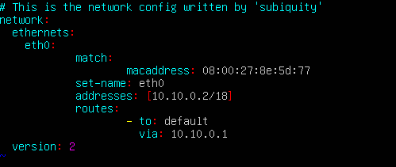 <br>
Рис. 5.17. Изменение файла конфигурации на первой рабочей станции<br>
 <br>
Рис. 5.18. Изменение файла конфигурации на второй рабочей станции<br>
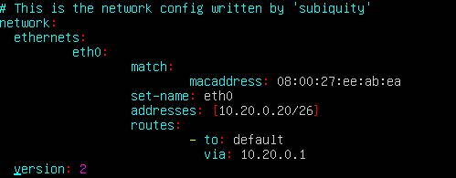 <br>
Рис. 5.19. Изменение файла конфигурации на третьей рабочей станции<br>

- Чтобы убедится, что маршрут добавился в таблицу вызовем команду

```
ip r
```

 <br>
Рис. 5.20. Вызов команды ip r на первой рабочей станции<br>
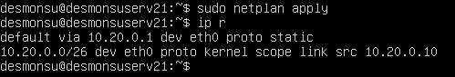 <br>
Рис. 5.21. Вызов команды ip r на второй рабочей станции<br>
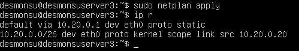 <br>
Рис. 5.22. Вызов команды ip r на третьей рабочей станции<br>

- С первой рабочей станции пропингуем второй роутер согласно тексту задания. Для этого используем второй роутер в качестве сервера и введем на нем команду

```
tcpdump -tn -i eth0
```

- А затем пингуем его с первой рабочей станции

 <br>
Рис. 5.23. Пинг первого роутера<br>
 <br>
Рис. 5.24. Вывод утилиты tcpdump на роутере<br>

- С помощью утилиты мы узнаем, что пинги до машины доходят, несмотря на информацию о 100%-ной потере пакетов

### Part 5.4. Добавление статических маршрутов

- Добавим в роутеры статические маршруты в файлы конфигураций

 <br>
Рис. 5.25. Конфигурация первого роутера<br>
 <br>
Рис. 5.26. Конфигурация второго роутера<br>

- вызовем ip r и убедимся, что маршруты добавлены

 <br>
Рис. 5.27. Таблица маршрутов первого роутера<br>
 <br>
Рис. 5.28. Таблица маршрутов второго роутера<br>

- Вызовем команды

```
ip r list 10.10.0.0/18
ip r list 0.0.0.0/0
```

 <br>
Рис. 5.29. Вывод команды ip r list на первой машине<br>

- Выбор маршрута для адреса 10.10.0.0/18 обоснован одним из принципов маршрутизации гласящим, что маршрутизатор всегда выбирает маршрут с самой длинной маской, потому что более длинная маска точнее описывает сеть назначения. Таким образом оптимизируется передача трафика, повышаются безопасность и гибкость системы. Маршрут по умолчанию обычно выбирается в случаях, когда отсутствуют другие возможные маршруты до нужного адреса.

### Part 5.5. Построение списка маршрутизаторов

- На первом роутере введем команду для перехвата трафика

```
tcpdump -tnv -i eth0
```

 <br>
Рис. 5.30. Перехват трафика на первом роутере<br>

- На ws11 запустим команду

```
traceroute 10.20.0.10
```

- При помощи утилиты traceroute построим список маршрутизаторов от ws11 до ws21

 <br>
Рис. 5.31. Список маршрутизаторов<br>

- Traceroute показывает все маршрутизаторы, которые пакет данных проходит от устройства до целевого хоста. Принцип работы traceroute заключается в использовании поля TTL (Time To Live) в заголовке пакеты данных. Каждый раз, когда пакет проходит через очередной маршрутизатор счетчик TTL уменьшается на 1. Когда TTL достигает 0, маршрутизатор отбрасывает его и отправляет обратно сообщение "Time exceeded" (Время (жизни пакета) истекло).

- Начиная отправлять пакеты со значением TTL = 1 traceroute узнает ближайшего соседа. Затем отправляется пакет со значением в 2 и traceroute узнает о соседе соседа. Это процесс повторяется до тех пор, пока:
- путь не будет найден
- не будет достигнут лимит TTL
- не истечет время ожидания ответа.

### Part 5.6. Использование протокола ICMP при маршрутизации

- Запустим перехват трафика на первом роутере с помошью команды

```
tcpdump -n -i eth0 icmp
```

- Пропингуем несуществующий ip

```
ping -c 1 10.30.0.111
```

 <br>
Рис. 5.32. Пинг несуществующего ip<br>

- Посмотрим на результат вывода утилиты

 <br>
Рис. 5.33. Перехват трафика на первом роутере<br>

- Сохраним дампы виртуальных машин.

## Part 6. Динамическая настройка IP с помощью DHCP

- Перейдем ко второму роутеру
- Настроим файл конфигурации /etc/dhcp/dhcpd.conf. Укажем адрес маршрутизатора по умолчанию, DNS-сервер и адрес внутренней сети

 <br>
Рис. 6.1. Файл конфигурации DHCP<br>

- В файле конфигурации resolv.conf прописываем nameserver 8.8.8.8

 <br>
Рис. 6.2. Файл Resolv<br>

- Перезагрузим службу DHCP на втором роутере командой

```
sudo systemctl restart isc-dhcp-server
```

 <br>
Рис. 6.3. Перезапуск службы<br>

- Изменим netplan на рабочей станции 21 на получение ip от dhcp

 <br>
Рис. 6.4. Netplan с DHCP<br>

- Перезапускаем машину командой reboot и командой ip a проверяем, что машина получила адрес. Также пингуем рабочую станцию ws22

 <br>
Рис. 6.5. Вывод ip a и успешный пинг<br>

- Выключаем машину ws11 и меняем в настройках VirtualBox ее MAC-адрес на 10:10:10:10:10:BA
- В файле конфигурации netplan изменяем MAC-адрес и возвращаем возможность получать адрес по DHCP, применяем netplan

 <br>
Рис. 6.6. Обновленный Netplan для ws11<br>

- Редактируем файл /etc/dhcp/dhcpd.conf на первом роутере аналогично предыдущему, но с жесткой привязкой к MAC-адресу

 <br>
Рис. 6.7. Обновленный DHCP для r1<br>

- и файл /etc/resolv.conf

 <br>
Рис. 6.8. Обновленный resolv для r1<br>

- перезагрузим службу DHCP

 <br>
Рис. 6.9. Перезагрузка DHCP на r1<br>

- Перезапускаем машину командой ребут и командой ip a проверяем, что машина получила адрес. Также пингуем рабочую станцию ws22

 <br>
Рис. 6.10. Вывод ip a и успешный пинг<br>

- Для запроса обновления ip-адреса с ws21 мы сначала проверим состояние до вызова функций

 <br>
Рис. 6.11. Состояние ip-адреса до<br>

- Затем вызовем функции

```
dhclient -r - для остановки текущей аренды ip-адреса
dhclient - для запроса нового ip-адреса
```

 <br>
Рис. 6.12. Состояние ip-адреса после<br>

- Для настройки DHCP использовались следующие опции:

  - subnet: определяет адресное пространство подсети
  - range: определяет диапазон ip-адресов, которые DHCP-сервер может назначать клиентам
  - option routers: определяет gateway по умолчанию для клиентов в этой подсети
  - option domain-name-servers: определяет адреса DNS-серверов, которые будут использованы клиентами
  - host: позволяет назначить опции для конуретного хоста по его MAC-адресу

- Сохраним дампы виртуальных машин

## Part 7. NAT

- Установим пакет Apache2, в файле /etc/apache2/ports.conf изменим порт на 0.0.0.0:80 сделав сервер общедоступным

 <br>
Рис. 7.1. Измененный файл Apache2 на рабочей машине<br>
 <br>
Рис. 7.2. Измененный файл Apache2 на роутере<br>

- Запускаем Apache2 на обеих машинах

 <br>
Рис. 7.3. Запуск сервиса на рабочей станции<br>
 <br>
Рис. 7.4. Запуск сервиса на роутере<br>

- Создадим файервол на роутере, аналогично файерволу из части 4.
- добавим правмла

```
iptables -F
iptables -F -t nat
iptables --policy FORWARD DROP
```

 <br>
Рис. 7.5. Настройка файервола<br>

- дадим нашему файерволу права на исполнение и запустим

 <br>
Рис. 7.6. Запуск файервола<br>

- Пропингуем машину 22 с первого роутера. По требованиям задания пинг не должен дойти

 <br>
Рис. 7.7. Неудачный пинг машины<br>

- Добавим в файервол новое правило

```
iptables -A FORWARD -p icmp -j ACCEPT
```

 <br>
Рис. 7.8. Обновленный файервол<br>

- С обновленными правилами машина должна пинговаться. Проверим.

 <br>
Рис. 7.9. Неудачный пинг машины<br>

- Добавим в файл еще два правила согласно задания и правило, позволяющее передавать данные по tcp-протоколу

```
iptables -A FORWARD -p tcp -j ACCEPT
iptables -t nat -A POSTROUTING -s 10.20.0.0/26 -o eth0 -j SNAT --to-source 10.100.0.12
iptables -t nat -A PREROUTING -p tcp -i eth0 --dport 8080 -j DNAT --to-destination 10.20.0.20:80
```

 <br>
Рис. 7.10. Вновь обновленный файервол<br>

- Запустим наш файервол с новыми правилами и на рабочей станции выполним команду

```
telnet 10.100.0.12 80
```

 <br>
Рис. 7.11. Успешное подключение по tcp для SNAT<br>

- Проверим соединение по tcp для DNAT. С сервера r1 подключаемся к серверу ws22 с помощью команды

```
telnet 10.100.0.12 8080
```

 <br>
Рис. 7.12. Успешное подключение по tcp для DNAT<br>
